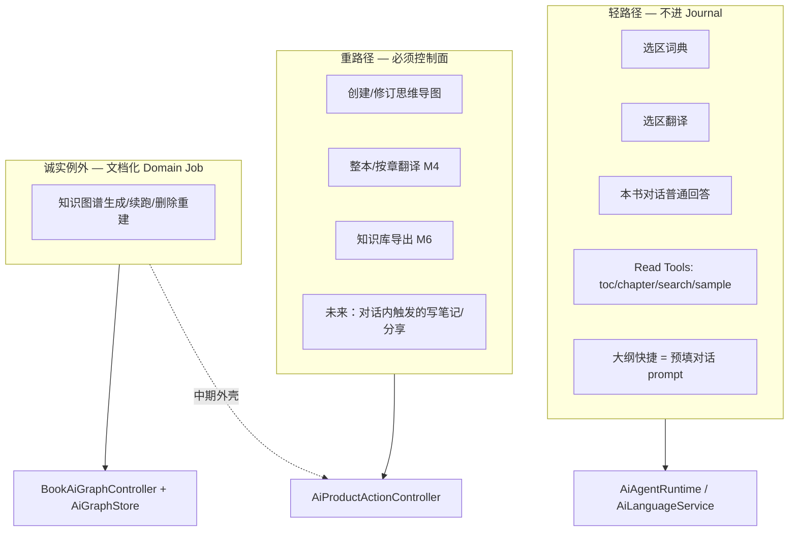
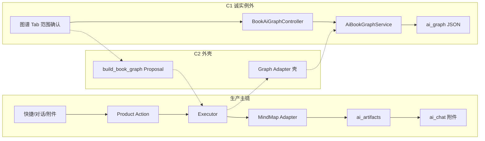

# 开卷 AI 板块架构与实现收口

| 字段 | 值 |
|------|-----|
| **文档标题** | 开卷 AI 板块架构与实现收口 |
| **作者** | （待填） |
| **日期** | 2026-08-12 |
| **状态** | **部分过时**：平台收口仍有用；**图书思维导图产品主路径已改为轻会话**（2026-08-12 文档转向） |
| **修订** | Rev3 Host/控制面；**Rev4 注**：导图不再以确认工单/Journal 为产品默认，见 [../specs/ai-mind-map.md](../specs/ai-mind-map.md) |
| **基线 commit** | `3048a835f36` 及后续收口提交 |
| **权威产品规格** | **导图以 `ai-mind-map.md` 为准**；重任务以 `ai-product-actions.md` 为准 |
| **读者** | 熟悉本仓库的工程师 |

> **2026-08-12 产品决定：** 导图日常体验对齐 Anx 式会话（直接出图、接着聊改细）；**不引入 LangChain**；Genkit 仅模型 I/O。本文中「导图必须经 Product Action 确认」的表述**作废**，实现应向轻路径收敛。平台六盒、图谱 Domain Job、重任务控制面仍可参考。

---

## Overview

开卷 AI 是**一书一智能体**的本地阅读增强：BYOK、`contentHash` 隔离、模型框架可替换。控制面骨架可用于重任务；**图书思维导图默认轻会话**，不得再把确认卡/强制「继续修改」写成正确体验。不引入 LangChain。

---

## Background & Motivation

### 产品身份（必须保持）

- 单安装包双引擎阅读 App；AI **仅图书 companion**，无全局 AI Tab，无托管模型。
- BYOK；Key 永不进 WebDAV。
- 一书一上下文（`contentHash`）；App 确定性编排；Genkit 只做 adapter / Agent Runtime。
- **建议 vs 授权分离**：模型 Tool Call 只产生 Proposal；仅 Policy / 可信 UI / 确认可签发 Command。
- 能力面：设置、语言（词典/翻译）、本书对话、大纲（产品：对话快捷）、图书思维导图（原生 Artifact）、知识图谱、未来整本译 + 导出。

### 当前实现：已有坚实地基（保留）

| 地基 | 代表代码 / 路径 | 为何保留 |
|------|-----------------|----------|
| BYOK + 设置/凭据分槽 | `AiSettings`、`SecureAiCredentialStore`、`AiSettingsController` | 产品底线 |
| 模型边界 | `AiModelAdapter` + `lib/ai/adapters/*`（Genkit 锁版隔离） | 可替换、无泄漏 |
| 结构事实 | `AiBookStructureResolver` / `AiBookStructureSession` | 对话/大纲/图谱共用 |
| 运行事件 | `AiRunOrchestrator` / `AiRunEvent` | UI 可重放、与 Journal 分离 |
| 控制面骨架 | `AiProductActionController`、`AiActionJournal`、`AiProductWorkflowExecutor` | 思维导图已证明 |
| 导图产物链 | `AiBookMindMapWorkflowAdapter` + Artifact CAS + Receipt-before-projection | 崩溃窗口已修 |
| 图谱内容管线 | `AiBookGraphService`（章级增量、证据、家族树） | 产品已交付 |
| 错误映射 | `ai_user_error.dart` | UI 不暴露供应商原文 |
| Mermaid ≠ 原生导图 | 富内容 vs Artifact | 边界清晰 |

### 诊断到的混乱（代码已核对）

以下问题在 `3048a835f36` 基线上仍真实存在：

1. **控制面仅覆盖思维导图**  
   生产 Domain 注册表只有 create/revise 导图（`kaijuanProductionActionDomains()`）。图谱 ~3k 行 `AiBookGraphService` + `BookReaderController` 图谱状态机走独立 checkpoint（`AiGraphStore` / `ai_graph/`），不经 Journal/Command。

2. **Chat Sheet 仍是编排中枢**  
   `book_ai_chat_sheet.dart` ≈ 2719 行：sealed switch 处理 `AiCreateBookMindMapAction` / `AiReviseBookMindMapAction`、确认卡、范围冻结、retry/recover、失败终态写 Journal。Domain Registry 存在，但 UI 主路径仍知道 mind-map 类型。

3. **双公开生成 API**  
   - 控制面：`BookAiWorkspaceController.runMindMapProductAction` → Executor  
   - 旁路：`generateMindMap` / `BookReaderController.generateBookMindMap` 仍 public，被 conversation 路径当作 `generateMap` 回调使用（模型层服务可保留，**产品入口不得旁路 Journal**）。

4. **能力门禁形同虚设**  
   生产环境统一 `AiCapabilitySet({})`（`BookAiWorkspaceController` 构造 / rebuild executor / `AiChatProductContext.toolDefinitions`）。`requiredCapabilities` 检查永远为空集通过。

5. **Workflow `stage()` 进程内**  
   `AiBookMindMapWorkflowAdapter.stage` 把正文与 `generateUnit` 回调放在内存 Map。冷启动 recover 若无 staged 输入：有完整 artifact 则补 Receipt；否则 `workflow_input_missing`。恢复不完整依赖「必须重新 stage 才能继续生成」。

6. **请求类型分裂 + 双定义注册表**  
   `sealed AiProductActionRequest` + `AiRegisteredProductAction` + Domain `parseToolCall`。扩展承诺「不改通用 switch」在 chat sheet `_executeAuthorizedProductAction` 上未兑现。更关键：Policy/Journal 用 `AiBookMindMapProductActions.registry`，工具目录/解析用 `kaijuanProductionActionDomains()`——**两套 definition 源**，schema/version 可漂移。Mind-map domain `createAdapter` 返回 null，adapter 由 Workspace 手绑。

7. **大纲：死 API / 维护陷阱（非双 UX）**  
   PRODUCT / ai.md 已定：大纲 = 对话快捷 + 普通消息。**当前 UI 无调用** `generateBookOutline` / `bookOutline`。残留是 `AiBookOutlineService` 装配、Reader 状态字段、WebDAV 时代 load——维护陷阱，不是用户可选的第二路径。

8. **规格诚实度分裂**  
   `ai-product-actions.md` 文首仍写「生产 Workflow、恢复尚未完成」，清单多项 `[x]` 过度宣称（含「缺失能力时不可执行」——在空能力集 + 空 `requiredCapabilities` 下为假）。ENGINEERING 仍描述 outline service 与 Reader 图谱门面。

9. **Reader god-facade**  
   `BookReaderController` ≈ 2350 行：仍持有图谱状态、大纲死状态、AI 兼容门面、结构/正文加载；Workspace 已拆但未收完。

10. **Agent 双栈叙事过长**  
    Legacy 默认 + Genkit Agent 门禁（取消语义正确）——应保留实现，但文档与代码注释应收敛为「一条 Runtime 契约 + 一个默认实现」。

11. **大文件（回归核对用）**  
    graph service 3042、chat sheet 2719、reader controller 2350、structure 1419、chat service 1047。

12. **`AiRegisteredProductAction` 路径误用测试注册表（地雷，非日常导图）**  
    `_runRegisteredProductAction` 调用 `kaijuanTestActionDomains()`（~1716 行）。**Mind-map create/revise 不走此路径**（sealed switch + 生产 domain 确认文案）。爆炸半径：任何 `AiRegisteredProductAction` 与「注册即可扩展」叙事；不是「所有生产动作都在测试域下跑」。

13. **Durable store 竞态**  
    Workspace 默认 Memory journal/artifact/checkpoint。`book_reader_screen.dart` `initState` 里 `unawaited(_attachAiStores())`；attach 完成前的 propose/recover 写内存，进程死后丢失，或 `replaceJournal` 中途换店。失败仅 `debugPrint`，不 fail-closed。

### 痛点本质

用户不怕重写，怕的是：**补丁叠补丁后不知道该改哪条路径**。  
收口的成功标准 = **每个意图只有一条生产路径**，新同学能用一张图答出「改 X 该动哪个盒子」。

---

## Goals & Non-Goals

### Goals

1. 固定 **永久心智模型**（≤ 6 个盒子 + 硬放置规则）。
2. 划分 **轻工具 vs 重产品动作**，明确谁必须进控制面。
3. 定义最终所有权：Runtime / Product Action / Domain Workflow / Persistence / UI Projection。
4. 给出现实可落地的 `lib/ai/` 与 presentation 包布局（Flutter 小团队，非微服务幻想）。
5. 逐能力说明终态：mind map / graph / outline / language / chat / settings。
6. **图谱策略二选一并推荐**：立刻上控制面 vs 诚实例外 + 边界。
7. **大纲终态**：纯对话回答；结构化服务仅兼容读或删除。
8. Domain Registry 成为**唯一**扩展路径；删除 sealed mind-map UI switch（分阶段）。
9. **单一恢复故事**：Journal + checkpoint + artifact + chat projection。
10. **反混沌规则**（编码与 review 可执行）。
11. **先减路径、后加功能** 的增量 PR 计划。
12. 可被现有代码库实现：引用真实文件与类型名。

### Non-Goals

- 本轮不实现 M4 整本译 / M6 Obsidian 导出（只预留控制面挂点）。
- 不把 Genkit `defineFlow` / Session / Artifact 变成产品事实。
- 不重写图谱抽取算法、消歧阈值、家族树规则（内容语义仍归 `ai-graph.md`）。
- 不改变导图模型输出格式（扁平 JSON 节点）——内容管线与控制面收口解耦。
- 不做全局 AI Tab、跨书知识库、账号托管模型。
- 不追求一次 PR 把 3k 行 graph service 搬进 Executor（除非单独立项）。

---

## Key Decisions

| # | 决策 | 理由 |
|---|------|------|
| K1 | **永久分层：Agent 回合 / 控制面 / 领域 Workflow / 持久化 / UI 投影** 五层，外加共享结构与模型 adapter 基础设施 | 已在 ENGINEERING 与 mind-map 生产链验证；混乱来自层间越权而非层本身错误 |
| K2 | **重动作必须进控制面**；轻工具与只读 Read Tool 不进 Journal | 有副作用、可取消、可恢复、需 Receipt 的才进；词典/翻译/对话读工具不应被 Journal 拖慢 |
| K3 | **图谱：诚实例外 C1（短期）+ 可选 job 级外壳 C2（中期）**；须在 `ai-product-actions.md` **明文规范例外**后才合法，不得声称「全重动作已进控制面」 | 图谱已有独立 Tab、章级 checkpoint、`ai_graph/` schema；强行套 mind-map unit 模型会双写 checkpoint。C1 不满足 §3.2 字面要求，故必须改规格；C2 是消解例外的路径 |
| K4 | **大纲终态 = 纯对话消息**；删除死生产表面（service 装配 / Reader 生成 API），schema 只读兼容 | 与 PRODUCT 对齐；当前无第二 UX，清的是维护陷阱 |
| K5 | **单一 Domain Registry 装配**；Policy 注册表、工具目录、parse、adapter 均派生自同一 `AiProductActionDomainRegistry`；删除或降级 `AiBookMindMapProductActions` 为 re-export | 消灭 definition 双源漂移 |
| K6 | **产品意图一条公开入口** ≠ 内容生成函数唯一。`runMindMapProductAction` 是唯一产品入口；`AiBookMindMapService.generate`（或 Workspace 内 private content hook）可被 adapter 调用，**不得**被 presentation 直接当产品 API | 避免 review 在 `@visibleForTesting` vs private 上空转 |
| K7 | **UI 永不拥有终态**；Sheet 只提交事件与渲染投影；**Journal 写入与 recover 编排归 `BookAiProductActionHost`（presentation controller 层）**，不在 State 类 | chat sheet 根因是 Widget 写终态 + 编排恢复 |
| K8 | **恢复唯一故事 + 唯一入口**：`Host.resumeFromInspect`（或等价 Workspace API）是 recover 编排权威；内部 `stage` 再 `executor.execute`；**禁止** Sheet 与 Adapter 各自一套 rebuild。Adapter.recover 只消费已 stage 的输入或 durable artifact/checkpoint | 今日 `_resumeRecoverableProductAction` 已在 UI 重 stage——收口后迁 Host 并删除 Widget 路径 |
| K9 | **能力词表 + 定义必填 + 非空快照**；生产禁止 `AiCapabilitySet({})`；mind-map definition 须声明真实 `requiredCapabilities`（见 §5.1） | 仅复活非空全局集不够——definition 为空则门禁仍死 |
| K10 | **包布局先逻辑、后物理**；优先删双路径再搬文件 | 小团队搬文件成本高 |
| K11 | **规格先诚实后扩展**；PR-0 逐行重验 checklist，假 `[x]` 降级 | Agents.md；防过度宣称 |
| K12 | **Agent 双栈保留实现、收敛叙事**：默认 Legacy，Genkit 门禁 | 取消语义未齐前不得默认 Genkit |
| K13 | **Journal / workflow checkpoint 默认不进 WebDAV**（工程默认，直至产品改口）。设备本地 best-effort；**无跨设备 resume**；第二设备忽略或 abandon 陈旧 `executing` | 避免多端抢执行；与 Security 表一致 |
| K14 | **AI workspace 在 durable stores attach 成功前 not-ready**：产品动作与产品 tool 禁用；attach 失败用户可见，不得静默 Memory | 修 `unawaited(_attachAiStores)` 竞态 |
| K15 | **图谱 C2 flag 默认关**（`enableGraphProductActionShell`）；产品验收前不默认开启 | 与 Rollout 一致 |
| K16 | **意图确认 UI ≠ `controller.approve`**；全链路对同一 proposal **只一次** `approve`/`authorize`，且必须在 `freezeScope` 之后带齐完整 `frozenArgs`；调用前 status ∈ {`proposed`,`awaitingConfirmation`}；authorized 后 Command 不可变 | `approve` 总会签发 Command；对齐 `_authorizeActionForExecution` |

---

## Proposed Design

### 1. 永久心智模型（六盒）

```text
┌─────────────────────────────────────────────────────────────┐
│ 0. 共享基础设施                                              │
│    Settings/Keys · ModelAdapter · StructureSession · Corpus  │
└─────────────────────────────────────────────────────────────┘
         │                              │
         ▼                              ▼
┌──────────────────┐          ┌──────────────────────────────┐
│ 1. Agent 回合     │          │ 2. 控制面 Control Plane       │
│  普通对话          │ Proposal │  Proposal→Policy→Command     │
│  Read Tools       │─────────▶│  Journal · Receipt · Cancel  │
│  流式投影          │          │  ProductActionController     │
│  AiAgentRuntime   │          │  WorkflowExecutor            │
└──────────────────┘          └──────────────┬───────────────┘
                                             │ Command
                                             ▼
                              ┌──────────────────────────────┐
                              │ 3. 领域 Workflow（确定性）      │
                              │  Adapter.preflight/start/     │
                              │  recover · 领域 Service        │
                              └──────────────┬───────────────┘
                                             │ Artifact / Domain store
                                             ▼
                              ┌──────────────────────────────┐
                              │ 4. 持久化 Persistence          │
                              │  ai_chat · ai_artifacts ·     │
                              │  ai_action_journal ·          │
                              │  ai_workflow_checkpoints ·    │
                              │  ai_graph（图谱例外存储）        │
                              └──────────────┬───────────────┘
                                             │ 投影
                                             ▼
                              ┌──────────────────────────────┐
                              │ 5. UI 投影 Projection          │
                              │  Workspace Controllers ·      │
                              │  Sheet/Tab 只渲染 · 不写终态    │
                              └──────────────────────────────┘
```

#### 硬放置规则（违反即拒审）

| 规则 | 说明 |
|------|------|
| R1 | **模型输出不得授权**。Tool Call / 自然语言 /「已生成」正文一律不是 Command。 |
| R2 | **Genkit 不得拥有产品事实**。无 Genkit Session/Artifact/Interrupt 作为 DB/WebDAV schema。 |
| R3 | **控制面不生成内容**。Controller/Journal/Executor 不拼 prompt、不读实时翻页位置。 |
| R4 | **领域 Workflow 不签发授权**。只接受 `AiAuthorizedCommand`（或图谱例外文档规定的等价入口）。 |
| R5 | **UI State 不写 Journal 终态 / 不 commit Artifact**。人机操作经 Host 调 `propose` / `approve` / `reject` / `requestCancel`；Sheet 只渲染。 |
| R6 | **每个用户意图一条产品入口**。禁止 presentation 调用无 Command 的 `generateX` 产品语义 API。 |
| R7 | **新增重动作只加 Domain 注册**；Policy 与 tool 定义同源。禁止改 chat sheet sealed switch / 通用 Executor。 |
| R8 | **投影在 Receipt 之后**；投影失败可重试，不得回写成生成失败。 |
| R9 | **别名不是身份**。模型只见 `work_n` / `artifact_n`；Gateway 在冻结快照内解析。 |
| R10 | **结构事实单源**。`AiBookStructureSession`；禁止 UI/Service 各自猜作品边界。 |
| R11 | **范围冻结只在 authorize 时进入 Command**；不得 authorize 空 scope 后再改 Command。 |
| R12 | **Recover 只经 Host 统一入口**；Adapter 不私自从磁盘「猜」用户意图。 |
| R13 | **Durable store not-ready 时禁止产品动作**。 |
| R14 | **Domain Job 例外须有规格条目与到期策略**；禁止口头例外。 |

### 2. 能力分类：轻工具 vs 重产品动作



| 类别 | 判定标准 | 当前成员 | 运行载体 |
|------|----------|----------|----------|
| **Read Tool** | 只读冻结上下文、无产品状态变更 | `get_toc` 等五工具 | Agent 工具循环 |
| **Light Assist** | 单步流式、无 Artifact 目录、失败可重试无幂等键需求 | 词典、选区译 | `AiLanguageService` + `AiRunOrchestrator` |
| **Chat Answer** | 普通消息持久化到 `ai_chat` | 自由问答、**大纲快捷** | `AiChatService` / ConversationController |
| **Product Action** | 改产品状态 / 产 Artifact / 可取消可恢复 / 需 Receipt | 思维导图 create/revise；未来译/导出 | Control Plane + Workflow |
| **Domain Job（规范例外）** | 长任务 + **自有增量快照格式** + 非对话主入口；**必须**在 product-actions 有明文 carve-out | 知识图谱（唯一当前成员） | GraphController；C2 可选 job 级 Journal |

**必须进控制面的充分条件（满足任一条）——默认规则：**

- 写入 `ai_artifacts` 或可版本化 Artifact 谱系；
- 需要跨进程幂等 / 晚到结果隔离 / `cancelRequested`；
- 模型 Tool 可建议且必须用户确认；
- 成功需可审计 Receipt 并驱动对话附件投影。

**规范例外（Domain Job）——仅当规格同时满足：**

1. `ai-product-actions.md` 列出 action 名称、替代控制存储、仍适用的规则（取消、用户确认范围、无模型直接写库）；
2. 标记临时（目标版本/里程碑消解）或经产品明示永久；
3. Review checklist 禁止复制例外（「下一个长任务默认控制面」）。

**图谱为何短期例外（工程）：** 主入口是独立 Tab + 范围确认，不是对话 Product Tool；进度事实是「已覆盖章节集合」的 `AiBookGraph` 快照，不是 mind-map unit 列表。硬套 unit 模型会**双写 checkpoint**。  
**图谱为何必须改规格（规范）：** 现行 §3.2「显式 UI 不能绕过 Policy、Journal、Workflow 预检」字面禁止 C1；在 PR-0 修正前，C1 是有意识的 **spec debt**，不是「已符合 product-actions」。

### 3. 最终所有权矩阵

| 职责 | 拥有者 | 明确不拥有 |
|------|--------|------------|
| Provider 归一 / schema / tool calling / trace | `AiModelAdapter` / Agent Runtime | 书籍范围、授权、DB |
| 冻结结构 / 作品 / 当前章 | `AiBookStructureSession` + Turn freeze | 实时翻页自动改 Command |
| Proposal / Policy / Command / Journal / Receipt | `AiProductActionController` | 提示词、生成循环 |
| 领域生成算法 | `AiBookMindMapService` / `AiBookGraphService` / … | 授权、UI、WebDAV |
| Artifact CAS / lineage head | `AiArtifactRepository` + 领域 codec | 对话消息正文 |
| 图谱缓存 | `AiGraphStore`（`ai_graph/`） | Journal（直至中期外壳） |
| 对话消息 / 附件投影 | `BookAiConversationController` + MindMapController | Workflow 内部进度细节 |
| UI 交互与等待态卡片 | Coordinator + Sheet | 终态判定、Receipt 提交 |
| WebDAV 快照合并 | `backup_service` | Key / 搜索 Key |

### 4. 目标模块布局（现实 Flutter）

**原则：** 目录表达所有权；**第一批 PR 不强制大搬迁**，先在文件头与 ENGINEERING 固定归属；物理移动作为「路径已单一」之后的整理 PR。

```text
lib/ai/
  # —— 基础设施（现有文件可逐步迁入子目录）——
  settings/          # ai_settings*.dart, credential（若抽出）
  runtime/           # ai_model_adapter*, ai_run*, ai_agent_runtime*,
                     # ai_cancel, ai_user_error, ai_log, adapters/
  structure/         # ai_book_structure*, ai_book_corpus, ai_book_structure_session,
                     # ai_structure_supplements, ai_graph_scope（规划器偏结构）
  control/           # ai_product_action*.dart, ai_action_journal*,
                     # ai_workflow_contract, ai_workflow_executor,
                     # ai_workflow_checkpoint*, ai_artifact*
  chat/              # ai_chat*.dart, ai_book_chat_tool_host, ai_conversation_intent
  language/          # ai_language_service, ai_translation
  domains/
    mind_map/        # service, workflow adapter, gateway, product actions, codec
    graph/           # service, store, evidence, quality, family_tree, response
    outline/         # 兼容读：AiBookOutline schema + 可选 legacy service
    export/          # 未来 M6 + 现 test_book_export
    translation_job/ # 未来 M4
  schemas/           # Schemantic 生成物（保持）

lib/presentation/controllers/
  ai_settings_controller.dart
  book_ai_workspace_controller.dart     # 组合根：Runtime + Control + Domains
  book_ai_conversation_controller.dart
  book_ai_mind_map_controller.dart
  book_ai_mind_map_coordinator.dart     # UI 等待态，非控制面
  book_ai_graph_controller.dart         # 新增：从 Reader 抽出图谱状态
  book_ai_reader_gateway.dart           # 阅读快照 → turn 上下文
  book_reader_controller.dart           # 阅读 + 薄 AI facade（逐步删 AI 状态）

lib/presentation/widgets/reader/
  book_ai_chat_sheet.dart               # Tab 壳 + 发送入口；无 sealed 领域执行
  book_ai_product_action_host.dart      # 新增：通用确认/进度/恢复投影
  book_ai_graph_workspace.dart          # 已有，改依赖 GraphController
  book_ai_mind_map_* / book_ai_graph_*  # 纯展示
```

`BookAiWorkspaceController` 继续作为 **composition root**（类似现实现），但职责收窄为：

1. 装配 settings → services；
2. 持有 `AiProductActionController` + DomainRegistry + Executor + stores；
3. 暴露 conversation / mindMap / graph 子 controller；
4. **不**暴露「无 Command 的 generateMindMap」产品入口；
5. 持有 `storesReady` 与 **单一** `AiProductActionDomainRegistry` 派生的 registry/adapters；
6. 构造/rebuild executor 时注入 **真实** `AiCapabilitySet`（禁止 `{}`）。

### 5. 各能力终态

#### 5.1 设置（Settings）与能力词表

- 保持：`AiSettingsController` + 设置页；总开关关闭则 `openModelAdapter() == null`。
- Key 边界不变。

**能力词表（稳定字符串，写入 `AiCapabilitySet.values`）：**

| Token | 含义 | Resolver 输入 |
|-------|------|----------------|
| `model.available` | AI 总开关开且 adapter 可打开 | settings + credential/Ollama |
| `model.structured_output` | 当前 adapter/provider 支持 `completeJson` 路径 | adapter kind + provider matrix |
| `model.native_tool_calling` | 对话产品 tool / Read tool 可用 | 同上 |
| `book.read` | 本书正文可加载（contentHash 文件在） | LibraryPaths + item |
| `runtime.true_cancel` | transport 可真实取消 | `AiAgentRuntimeGate` / adapter |
| `storage.journal` | durable journal 已 attach | workspace ready flag |
| `storage.artifact` | durable artifact repo 已 attach | 同上 |
| `storage.checkpoint` | durable workflow checkpoint 已 attach | 同上 |

**Mind-map definition 目标 `requiredCapabilities`：**  
`{model.available, model.structured_output, book.read, storage.journal, storage.artifact, storage.checkpoint}`  
（今日 create/revise 的 `requiredCapabilities` 为空——PR-7 必须写入。）

**`AiCapabilityResolver.resolve` 输入：** settings snapshot、openModelAdapter 结果、runtime gate decision、`workspace.storesReady`、item.contentHash 可读性。  
**同一快照**传入：`toolDescriptors`、`propose(..., capabilities:)`、`AiWorkflowEnvironment.capabilities`。

**硬编码 tool 兜底：** `AiChatProductContext` 在 `actionRegistry == null` 时的内联 mind-map schema → 生产路径删除；仅 `@visibleForTesting`。

#### 5.2 语言工具（词典 / 选区翻译）

- **保持轻路径**：`AiLanguageService` + 选区 sheet；不进 Product Action。
- 统一经 `AiRunOrchestrator`；错误映射 `AiUserOperation`。
- M4 整本译是**另一动作**（重路径），不得复用选区 API 伪装。

#### 5.3 本书对话（Chat）

- Agent 回合：`BookAiConversationController` + `AiAgentRuntime`（默认 Legacy）。
- 产品工具目录：**仅** 统一 Domain 装配的 registry + **真实** capability snapshot。
- Tool 解析：只走 `domains.parseToolCall`。
- 普通回答 / Read Tool / Proposal 三分；混用读工具与产品终止工具继续禁止。
- **`storesReady == false` 时不暴露产品 tool**，不发送产品 Proposal。

#### 5.4 大纲（Outline）

**终态（产品已定）：**

```text
快捷「生成本书大纲」→ 与手输相同的 _send 路径 → 普通助手消息
```

**现状澄清：** 无 presentation widget 调用 `generateBookOutline`；残留是死 API / 死状态 / Workspace 无用装配，**不是**用户可走的双 UX。PR-3 目标是清维护陷阱与心智噪音。

| 项 | 动作 |
|----|------|
| `AiChatShortcut` 大纲 | 保留 |
| `generateBookOutline` / Workspace `outline` 装配 | 删除生产表面；测试迁移后删 |
| `_bookOutline*` Reader 字段 | PR-11 清理；确认无 UI 绑定 |
| `AiBookOutline` schema + `fromJson` | **保留**，WebDAV/会话读旧缓存 |
| WebDAV | 继续合并历史 `outline`；本地优先；不新增写路径 |

**不把大纲注册为 Product Action。**

#### 5.5 图书思维导图（Mind Map）

**唯一产品入口链：**

```text
入口（快捷 / 自由输入 tool / 附件修订 / 重试 / Host.recover）
  → Host 状态机（§6.1）
  → AiAuthorizedCommand（authorize 时写入冻结 scope）+ Journal
  → Workspace.runMindMapProductAction（stage + executor）
  → AiBookMindMapWorkflowAdapter
  → AiBookMindMapService.generate（内容 hook，非产品 API）
  → Artifact CAS → checkpoint → Receipt
  → BookAiMindMapController 投影附件
```

**内容 hook vs 产品入口（K6）：**

| 符号 | 角色 | 可见性 |
|------|------|--------|
| `runMindMapProductAction` | 产品编排：stage → execute → project | Workspace **唯一**产品公开入口 |
| `AiBookMindMapService.generate` | 单范围内容生成 | service / adapter 内部；测试可直接调 |
| 今日 `generateMindMap` / `generateBookMindMap` | 历史 facade | 删除 public 产品语义；若保留则为 service 测试辅助，presentation 禁调 |

**内容格式：** 扁平 JSON 节点不变；与控制面收口脱钩。

##### 5.5.1 Host 状态机（对齐生产冻结序 / Strategy A）

**硬约束（与 K16、`AiProductActionController` API 一致）：**

- `controller.approve` / `controller.authorize` **总会**签发不可变 `AiAuthorizedCommand`（经 `_commandFor`）。**不存在**「approve 但不带 scope」API。
- **意图确认卡通过 ≠ `controller.approve`。** 确认卡只是 UI 门闩；用户点「否」才调 `controller.reject`。
- **全进程对同一 proposal 只调用一次** `approve` 或 `authorize`，且**必须**在 `freezeScope` 之后携带完整 `frozenArgs`（含 `scopeSectionIndices` / `unitLabels` / `unitSectionCounts` / `scopeFingerprint` / `contentHash`）。
- 调用前 Journal 状态只能是 `awaitingConfirmation`（走 `approve`）或 `proposed`（走 `authorize`）。**禁止**发明「已 approve 但无 scope」中间态。
- `authorized` 之后 Command 不可变；不得为补 scope 再次 approve/authorize。

**生产真相**（`book_ai_chat_sheet.dart` `_dispatchProductActionUnsafe` + `_authorizeActionForExecution`）：

1. `propose` → 自由输入常为 `awaitingConfirmation`；显式 UI + Policy allow 且 `deferExplicitAuthorization` 时可为 `proposed`；少数矩阵直接 `authorized`（已带决策，Host 仍须在执行前保证 Command 含冻结 scope——mind-map 生产路径以 needsConfirmation / proposed 为主）。
2. `needsConfirmation` → `requestActionConfirmation` **仅 UI bool**；`true` 时 **不**调用 `controller.approve`，Journal **保持** `awaitingConfirmation`；`false` → `controller.reject` 并返回。
3. `resolveCreate` / 范围卡 / `_freezeMindMapUnits` — 仍不写 Command。
4. **`_authorizeActionForExecution(units)`** — 组装完整 `frozenArgs` 后：
   - status == `awaitingConfirmation` → **唯一** `controller.approve(..., normalizedArguments: frozenArgs)`；
   - status == `proposed` → **唯一** `controller.authorize(..., normalizedArguments: frozenArgs)`；
   - 再 `queue`。
5. `runMindMapProductAction` → `adapter.stage` → `workflowExecutor.execute`。

**目标通用序列（Strategy A — 权威伪代码）：**

```text
propose(proposal, capabilities)
  → deny / needsClarification → 终态文案或新 propose；return
  → [needsConfirmation?
        domain.confirmationView + coordinator UI
        userReject → controller.reject; return
        userAccept → // ★ 仅 UI 继续；不调用 controller.approve
                     // Journal 仍为 awaitingConfirmation
     ]
  // 此处 status ∈ { awaitingConfirmation, proposed }
  // （Policy allow + deferExplicitAuthorization → proposed，同样等 post-freeze 一次 authorize）
  → domain.resolveIntent(request, frozenTurn)
  → domain.collectScope(ui, intent)     // 范围卡 / 多作品；可取消 → reject 或 completeCancelled
  → domain.freezeScope(units)           // 内存加载正文；不写 Journal
  → // ★ 全链路唯一授权调用 — 与 _authorizeActionForExecution 同构
     if status == awaitingConfirmation:
       controller.approve(
         authorizationEvidence: 'conversation:confirm',  // 或合并 UI 意图确认证据
         normalizedArguments: frozenArgs)  // 必须含完整 scope 冻结字段
     else if status == proposed:
       controller.authorize(
         authorizationEvidence: 'ui:…-scope-confirmed',
         normalizedArguments: frozenArgs)
     else: throw / abandon  // 不得对已 authorized 再补 args
  → controller.queue
  → workspace.stageAndExecute(command, stagedRun)
  → host.project(domain.projection)
```

**frozenArgs 最低字段**（authorize 瞬间写入 Command，恢复依赖）：

```text
scopeSectionIndices, unitLabels, unitSectionCounts,
scopeFingerprint, contentHash, workKey?
```

**关于 confirmation 与 scope（推荐 A；B 可选）：**

| | 意图/风险确认卡 | Journal 在确认卡之后 | 唯一 `approve`/`authorize` |
|--|----------------|----------------------|---------------------------|
| **A（生产对齐，推荐）** | propose 后、scope **前**；**UI-only** | 仍 `awaitingConfirmation` 或保持 `proposed` | freeze **之后**一次，带齐 `frozenArgs` |
| B | scope **后**再确认摘要 | 确认前仍非 authorized | freeze+用户确认摘要后一次 |

采用 **A**：确认卡表达「是否做这类产品动作」；章节集合在范围卡后才冻结。  
**禁止**把 A 误实现为「确认卡里 `approve` 空 Command，再 mutate」——`approve` 无此语义，且第二次调用会 throw。

**Mind-map 工作实例（真实方法映射）：**

| Host 步骤 | 现网方法 / 目标归属 | 是否写 Journal / Command |
|-----------|---------------------|---------------------------|
| propose | `_proposalForProductAction` + `propose` | 是（proposed / awaitingConfirmation / …） |
| intent confirm UI | `requestActionConfirmation` | **否**（reject 除外） |
| resolveIntent | `AiBookMindMapActionGateway.resolveCreate` | 否 |
| collectScope | `_routeMindMapRequest` / scope card | 否 |
| freezeScope | `_freezeMindMapUnits` | 否 |
| **唯一 authorize** | `_authorizeActionForExecution` → `approve`\|`authorize`+`queue` | **是**（完整 frozenArgs → Command） |
| stage+execute | `runMindMapProductAction` | checkpoint / receipt |
| project | `projectReceiptArtifacts` | markProjected |

##### 5.5.2 单一恢复故事（算法）

**唯一入口：** `BookAiProductActionHost.resumeAfterOpen(contentHash)`（从 Sheet 的 `_load` 恢复块迁出）。  
内部使用 `actionController.inspectRecovery()`，按 disposition 分支——**Sheet 不得再实现第二套 rebuild。**

```mermaid
sequenceDiagram
  participant H as ProductActionHost
  participant J as ActionJournal
  participant W as Workspace
  participant E as WorkflowExecutor
  participant A as MindMapAdapter
  participant R as ArtifactRepo

  H->>J: inspectRecovery()
  alt needsProjection
    H->>W: reconcilePendingProjection(entry)
  else waitingForHuman
    H->>H: 展示确认卡（UI-only；通过≠approve）
    Note over H: reject → controller.reject; accept → 续 §5.5.1 自 resolveIntent
    Note over H: currentChapter → abandon frozen_chapter_context_missing
  else recoverable
    H->>H: rebuildUnitsFromCommand(command)
    Note over H: 失败 → abandon frozen_scope_content_missing
    H->>W: stageFromUnits(command, units, contentHook)
    H->>E: execute(proposalId)
    E->>A: start 或 recover(checkpoint)
    A->>R: 已有 artifact 则跳过生成
  else terminal / abandon
    H->>H: 忽略或展示
  end
```

**`rebuildUnitsFromCommand`（迁自 `_resumeRecoverableProductAction` / `_unitsFromCommand`，并修正多 unit）：**

Command 必选字段（authorize 时已写入，**不新增也可工作**）：

- `contentHash`（command 顶栏 + args）
- `workKey?`
- `scopeSectionIndices: List<int>`
- `unitLabels: List<String>`
- `unitSectionCounts: List<int>`（与 labels 等长）
- `scopeFingerprint`（现网 `sections:1,2,...`）
- revise：`targetArtifactId` + `expectedRevision`

算法：

1. 若 proposal.scope 或 args.scope == `currentChapter` → **`abandon(frozen_chapter_context_missing)`**（章正文不进 Journal；不静默换成当前页）。**不在 propose 阶段一律 ban currentChapter**——在线路径仍允许；仅 **recover** 放弃。
2. 加载 `bookMindMapSections(workKey)`（结构变更时 indices 过滤；空 → abandon `frozen_scope_content_missing`）。
3. **多 unit：** 若 `unitLabels.length == unitSectionCounts.length > 1`，按 counts 切分 `scopeSectionIndices` 连续前缀为多 unit（segmented 出版物）。若仅 `unitLabels` 非空但 counts 缺失/长度为 1，则 **单 unit** 含全部 indices（兼容现网 `_unitsFromCommand` 用 `frozenLabels.first` 的行为，并在 authorize 时**强制写入正确 counts** 以便冷恢复）。
4. revise：从会话附件目录取 target；revision 不匹配 → abandon `target_revision_changed`。
5. 构造 `AiBookMindMapStagedRun`：  
   - `units` = 上一步；  
   - `generateUnit` = **Workspace 绑定的 content hook** → 直接 `AiBookMindMapService.generate`（或现 private `_runMindMap`），**禁止**捕获 BuildContext / Sheet State；  
   - `onProgress` = MindMapController 进度投影回调（Workspace 持有）。
6. `adapter.stage(commandId, stagedRun)`。
7. 若 status==authorized → `queue`；executing 保持不动。
8. `workflowExecutor.execute` → Adapter `start`/`recover`：  
   - checkpoint/orphan artifact 完整 → 不重生成（现逻辑）；  
   - 否则消费 **本次 stage** 续跑 `completedUnits`。

**删除双重恢复：** PR-8 验收要求 **删除** Sheet 内 `_resumeRecoverableProductAction` 的独立实现（改为调 Host）；**禁止**「仅 Adapter.recover 内部静默 loader、Host 又 stage 一次」的双路径。允许 Adapter.recover 在 **已 stage** 或 **仅 artifact 补 Receipt** 两种模式；缺 stage 且缺可验证 artifact → `workflow_input_missing`（Host 应在 execute 前 stage，避免落到此分支）。

**验收测试（PR-8）：**

1. 杀进程于 unit 中途，有 durable checkpoint `completedUnits` → 续跑不重复已提交 artifact；  
2. 仅有 orphan artifact、无 checkpoint → 补 Receipt，不重生成；  
3. segmented 多 unit（counts≥2）冷恢复 unit 边界正确；  
4. section 正文缺失 / EPUB 不可读 → abandon + 用户文案，不空跑模型；  
5. `currentChapter` recoverable → abandon，不替换当前页。

#### 5.6 知识图谱（Graph）— 策略详析与推荐

##### 方案 A：立刻整管线迁入控制面（含每章建模为 attempt）

| 优点 | 缺点 |
|------|------|
| 字面满足 product-actions | 章级增量重建模成本高；双 checkpoint 风险；阻塞变薄 4–8 周 |

##### 方案 B：永久例外、永不控制面

| 优点 | 缺点 |
|------|------|
| 零迁移 | 永久双哲学；易被复制；对话触发重建无授权模型 |

##### 方案 C（推荐）：C1 规范例外 + 边界硬化 + 可选 C2 job 外壳

**C1 工程（本收口必须）+ PR-0 规格 carve-out（规范必须）：**

PR-0 必须在 `ai-product-actions.md` 增加 **dated 例外条款**，示例要点：

```text
## 例外：Domain Jobs（2026-08-12）

在下列条件全部满足时，允许显式 UI 启动的领域长任务暂不经
AiProductActionController，而使用文档化的领域控制存储：

1. 主入口不是对话 Product Tool；
2. 已有稳定领域快照格式且与 mind-map unit checkpoint 异构；
3. 规格列出唯一成员与消解计划；
4. 仍必须：用户确认范围、取消停止新副作用、Key 不进备份、
   模型不直接写身份键。

当前唯一成员：知识图谱（AiGraphStore 章级快照）。
消解：里程碑 C2 job 级 Journal 外壳，或产品书面永久例外。
新增 Domain Job 默认禁止，须修订本条款。
```

同时 `ai-graph.md` 镜像 §7 用户语义对照表。

C1 代码边界：

1. `BookAiGraphController` 持状态；Reader 仅过渡转发。  
2. 唯一写入口：`startGeneration / cancel / delete`；唯一持久化 `AiGraphStore`。  
3. UI 不持 service；**禁止** chat sheet 编排图谱。  
4. 用户恢复：「打开图谱 Tab → 续跑未完成章节」——不假装 Journal。

**C2（独立里程碑，flag 默认关）：** job 级 `build_book_graph` Proposal/Journal/Receipt；**内部仍** `AiBookGraphService` + 既有章级 `AiGraphStore` checkpoint；不把每章拆成多个 Product Action。

**推荐：C。** 首批 C1+规格；C2 在 mind-map Host/注册表/能力门禁之后。

#### 5.7 未来 M4 / M6

- 自第一天起只经 Domain 注册 + 控制面；参考 `AiTestBookExportDomain`。
- 禁止在 `book_ai_chat_sheet` 增加 case。

### 6. Domain Registry：唯一扩展路径

#### 6.1 Host + Domain 契约（PR-6 冻结目标，非模糊 spike）

现有（`ai_product_action_domain.dart`）：`parseToolCall` / `confirmationView` / `createAdapter` / `projectionMessage` / `definition`。

**扩展后的域接口（具体类型，避免 `Object stagePayload` 擦除）：**

```dart
abstract interface class AiProductActionDomain {
  String get actionKind;
  Set<String> get toolNames;
  bool get productionExposed;
  AiProductActionDefinition get definition;

  AiProductActionRequest parseToolCall(AiModelToolCall call, AiChatProductContext ctx);

  AiProductActionConfirmationView confirmationView(
    AiProductActionRequest request, {required Map<String, Object?> contextHints});

  /// Gateway: aliases → domain intent (no Journal write).
  AiDomainIntent resolveIntent(
    AiProductActionRequest request,
    AiDomainTurnContext turn,
  );

  /// Optional interactive scope. null = no extra UI (e.g. test export).
  Future<AiDomainScopeSelection?> collectScope({
    required AiDomainIntent intent,
    required AiDomainScopeUi ui, // coordinator callbacks, not BuildContext
  });

  /// Load bodies into memory units; build authorize normalizedArguments.
  /// Does not call controller.authorize.
  Future<AiDomainFreezeResult> freezeScope({
    required AiDomainIntent intent,
    required AiDomainScopeSelection selection,
    required AiDomainCorpus corpus, // bookMindMapSections etc.
  });

  /// Build adapter stage payload after Command exists (uses commandId).
  AiDomainStageBinding bindStage({
    required AiAuthorizedCommand command,
    required AiDomainFreezeResult freeze,
    required AiDomainContentHooks hooks, // service.generate, progress
  });

  AiWorkflowAdapter? createAdapter(AiArtifactRepository artifacts);

  /// Projection after Receipt — domain chooses shape.
  AiDomainProjection projection({
    required AiProductActionRequest? request,
    required AiActionJournalEntry entry,
  });
}

sealed class AiDomainProjection {
  const AiDomainProjection();
}
final class AiDomainMessageProjection extends AiDomainProjection {
  const AiDomainMessageProjection(this.message);
  final String message; // test export, generic
}
final class AiDomainArtifactAttachmentProjection extends AiDomainProjection {
  const AiDomainArtifactAttachmentProjection({
    required this.artifactRefs,
    required this.turnId,
    required this.workKey,
    // mind-map: unitLabels / sectionCounts for card copy
    this.unitLabels = const [],
    this.unitSectionCounts = const [],
  });
  final List<String> artifactRefs;
  final String turnId;
  final String? workKey;
  final List<String> unitLabels;
  final List<int> unitSectionCounts;
}

class AiDomainFreezeResult {
  const AiDomainFreezeResult({
    required this.normalizedArguments, // scopeSectionIndices, unitLabels, ...
    required this.memoryUnits,         // domain-private list for stage
  });
  final Map<String, Object?> normalizedArguments;
  final Object memoryUnits; // e.g. List<BookAiMindMapGenerationUnit> in mind-map domain file
}
```

**Host 不 switch 请求子类：** 只调 `domain.byActionKind(proposal.actionKind)`。  
Mind-map 仍可在 domain 文件内把 `parseToolCall` 结果做成 `AiCreateBookMindMapAction`；对 Host 而言是不透明 `AiProductActionRequest`。

**Mind-map `bindStage`：** 产出 `AiBookMindMapStagedRun` 并 `adapter.stage(command.commandId, …)`。  
**Test export `collectScope`：** null；`freezeScope` 仅 contentHash；`projection` → `AiDomainMessageProjection`。

#### 6.2 删除 sealed UI 分支的节奏

1. PR-5：逻辑进 Host，可仍有 mind-map 私有方法（**非**成功标准「双路径消失」）。  
2. PR-6：Host 只走 domain hooks；删 Host 内 sealed execute switch。  
3. 随后：导图 action 类型移入 domain 目录，presentation 不 import 具体子类。

#### 6.3 单一注册表装配（消灭双 definition 源）

**现状问题：**

| 用途 | 今日源 |
|------|--------|
| Policy / Journal `registry.lookup` | `AiBookMindMapProductActions.registry` |
| Tool 目录 / parse | `kaijuanProductionActionDomains()` |
| Adapters | Workspace 手写 create/revise adapter；domain.createAdapter == null |

**目标（PR-4b / PR-6 前必达）：**

```dart
// BookAiWorkspaceController 唯一装配
final domains = kaijuanProductionActionDomains(); // definition 只在 domain 内定义一份
actionController = AiProductActionController(
  registry: domains.asActionRegistry(productionOnly: true),
  journal: journal, // durable after attach
);
workflowAdapters = AiWorkflowAdapterRegistry(
  domains.buildAdapters(artifactRepository), // mind-map createAdapter 非 null
);
// AiBookMindMapProductActions → re-export domain.definition 或删除
```

测试中硬编码 `AiBookMindMapProductActions.registry` 改为 `kaijuanProductionActionDomains().asActionRegistry()`。

**PR-1 范围收窄：** 仅修 sheet 误用 `kaijuanTestActionDomains`；assert presentation 不 import test 域；`productionExposed == false` 在生产 Host fail-fast。  
**不**声称「所有生产动作曾跑在测试域下」——mind-map 主路径未走 registered 分支。

### 7. 恢复模型：单一故事

执行态恢复见 **§5.5.2**（权威算法）。下表为 Journal 语义总览。

| Journal 状态 | disposition | Host 动作 |
|--------------|-------------|-----------|
| awaitingConfirmation / proposed | waitingForHuman | 确认卡；`currentChapter` → abandon |
| authorized / queued | recoverable | rebuild units → stage → queue → execute |
| executing | recoverable | rebuild units → stage → execute（executor 走 adapter.recover） |
| succeeded + pendingProjection | needsProjection | 只 `reconcilePendingProjection` |
| cancelRequested | recoverable/特殊 | 完成取消，不提交新产物 |
| failed / cancelled / abandoned | terminal | 展示；retry = `prepareRetry` 新 attempt |

**图谱 C1 对照（写入 ai-graph.md）：**

| 用户感知 | 图谱实现 |
|----------|----------|
| 进行中 | GraphController future + progress |
| 断点续跑 | `AiBookGraph` 已处理章节 + service 增量 |
| 取消 | CancelToken；保留 partial |
| 成功 | `ai_graph/` |
| Journal | C1 无；C2 job 级 |

**对话中断：** `AiChatSessionOps.recoverInterruptedTurns` 与 Journal 并行、不相吞。

**多设备：** Journal 不进 WebDAV（K13）。设备 A 上 `executing` 条目不会在设备 B 恢复；B 无义务 resume，可见则可 abandon 陈旧条目。无跨设备 resume。

### 8. 反混沌规则（工程契约）

1. **One path per intent** — code review 检查表项；双 public API 直接拒。
2. **No dual generate** — `generate*` 名称若无 Command 参数，不得被 presentation 调用。
3. **UI never owns terminal status** — Widget 禁止 `completeForProposal` / `journal.write`（今日 chat sheet 多处违反，迁 Host/Controller）。
4. **Domain registry only extension** — 新增 actionKind 的 PR diff 不得改 `AiProductWorkflowExecutor` / generic Host 控制流。
5. **Empty capability set forbidden in production** — assert 或 debug 检查。
6. **Spec honesty** — 文首状态与 checklist 一致；未测通不得 `[x]`。
7. **Thin first** — 每个收口 PR 以删除路径/行数为成功标准之一。
8. **No Genkit product orchestration** — 已有边界，复述以拒审。

### 9. 控制面 vs 图谱例外架构图



---

## API / Interface Changes

### 删除或降级的公开 API

| API | 现状 | 目标 |
|-----|------|------|
| `BookAiWorkspaceController.generateMindMap` | public 旁路 | `@visibleForTesting` 或 private，仅 service 测 |
| `BookReaderController.generateBookMindMap` | public facade | 删除或 testing-only；对话路径不经此「产品入口」语义 |
| `BookReaderController.generateBookOutline` | 死 API（无 UI 调用） | 删除生产表面 |
| `BookReaderController` 图谱字段 | 状态在 Reader | 迁 `BookAiGraphController` |
| chat sheet sealed execute | Widget 编排 | `BookAiProductActionHost` + domain hooks |
| `_runRegisteredProductAction` → test domains | 扩展路径地雷 | 生产 registry；test 域仅 harness |
| `AiBookMindMapProductActions.registry` 双源 | Policy 与 tool 分叉 | 单一 domain 派生 |
| 无 `storesReady` 门闩 | Memory 竞态 | not-ready 禁用产品动作 |

### 新增 / 收紧

| API | 说明 |
|-----|------|
| `AiCapabilityResolver.resolve(...)` | 词表见 §5.1 |
| `BookAiProductActionHost` | propose→confirm→collectScope→freeze→authorize→stage→execute→project；**拥有 recover** |
| `BookAiWorkspaceController.storesReady` | durable attach 门闩 |
| `BookAiGraphController` | 图谱 Domain Job |
| Domain `resolveIntent/collectScope/freezeScope/bindStage/projection` | §6.1 |
| Mind-map `createAdapter` 非 null | 与 domain 注册同源 |

### 不变

- `AiProductActionController.propose/approve/reject/prepareRetry/...`（authorize 时写入冻结 args）
- `AiProductWorkflowExecutor.execute` 语义
- 思维导图 Artifact codec / revision CAS
- Read Tool 集合与四轮上限

---

## Data Model Changes

### 无强制 schema 破坏（首批）

| 存储 | 路径 | 变更 |
|------|------|------|
| 对话 | `ai_chat/` | 无；大纲旧字段只读兼容 |
| 导图 Artifact | `ai_artifacts/` | 无 |
| Journal | `ai_action_journal/` | 生产必须 JSON；**attach 前不写** |
| Workflow checkpoint | `ai_workflow_checkpoints/` | 无强制新字段；authorize 已写 `scopeFingerprint` |
| 图谱 | `ai_graph/` | C1 无；C2 可选 `jobProposalId` |
| 设置 | `ai_settings.json` | 无 Key |

### 迁移策略

- **大纲：** 静默读历史字段；不展示独立 Tab；不写新结构化大纲。
- **导图：** 附件与 Artifact 兼容（已有）。
- **WebDAV：** Key 永不进；**Journal/checkpoint 默认不进**（K13）；无跨设备 resume。

### Durable attach 门闩（PR-2 强制）

```text
initState:
  workspace.storesReady = false
  await _attachAiStores()  // 不再 unawaited 作为唯一路径
    success → replaceJournal/Checkpoints/Artifacts → storesReady = true
    failure → storesReady = false + 用户可见错误（设置/横幅），保持 Memory 但禁用产品动作

门禁：
  storesReady 前：不暴露产品 tool；Host.propose 直接 deny/短路；
  recover 不运行产品 resume；普通聊天是否允许另定（建议：可聊但无产品 tool）
```

测试：打开阅读器 → 在 attach 完成前尝试 shortcut 导图 → 不得落 Memory-only 终态文件缺失；attach 后 propose 必有 journal 文件。

---

## Alternatives Considered

### Alt-1：把一切（含对话、词典）塞进 Product Action

- **否决：** Journal 噪声、选区延迟；轻工具不满足充分条件。

### Alt-2：放弃 Product Action，退回 Service + UI 状态机

- **否决：** 导图恢复/幂等/授权投入回退；扩展再复制 sheet。

### Alt-3：图谱立刻全量控制面（含每章 attempt）

- **否决：** 见 §5.6 A；阻塞变薄。

### Alt-3b：不做 C1 GraphController，直接上 C2 job 级 Journal 外壳

- **做法：** Reader 仍持图谱状态，仅在 generate 外包一层 Proposal/Journal。  
- **优点：** 更早字面满足 product-actions。  
- **缺点：** Reader god-facade 更胖；job 外壳与 UI 状态耦合难测；review 无法先验收「单一图谱写入口」。  
- **否决（排序）：** C1-first 让「所有权边界」与「控制面外壳」可分别 review；C2 在瘦 facade 上打补丁更安全。成本上 C2-only 并不省——仍要写 adapter/flag/测试，却少了可测的 GraphController 缝。

### Alt-3c：C2 job 外壳作为「中间路径」与 C 的关系

- C2 **就是** job 级 Journal only（非每章 Product Action）——§5.6 已采用为消解例外的路径。  
- 与 Alt-3 的差别：不重建章级 checkpoint 到控制面 payload。  
- 与永久例外 B 的差别：有明确消解与 flag。

### Alt-4：多 package 物理拆分

- **否决：** 小团队过重；目录所有权足够。

### Alt-5：大纲保留结构化「高级模式」

- **否决：** PRODUCT 已定对话快捷；会制造真双路径。

---

## Security & Privacy Considerations

| 威胁 | 缓解 |
|------|------|
| Key 泄漏 | Secure store；备份排除；日志不打印 Key/正文 |
| 提示注入 | fence；Read Tool 预算；产品工具不直接授权 |
| 未授权副作用 | Proposal≠Command；Gateway 别名；Policy；authorize 才冻 scope |
| 跨作品泄漏 | StructureSession + 冻结 scope；ToolHost 再收窄 |
| 图谱未读 | `allowUnreadContext` + 用户确认 |
| 多设备 Journal | **不进 WebDAV**；本地 best-effort；**无跨设备 resume**；他机陈旧 executing 不自动续跑 |
| 测试域 / 非 productionExposed | PR-1 fail-fast；presentation 禁 import test registry |
| Memory journal 冒充耐久 | storesReady 门闩；attach 失败可见 |

---

## Observability

| 信号 | 实现建议 |
|------|----------|
| 动作生命周期 | Journal 状态转换已有；统一 `AiLog.d` 字段：`proposalId, actionKind, status, attempt` |
| Workflow | Executor 已区分 start/recover；log `workflowRunId` + publicErrorCode |
| 能力门禁拒绝 | `reasonCode=missing_capability` 计数（调试面板或 log） |
| 恢复 | recover 时 log disposition（terminal / recoverable / needsProjection） |
| 图谱 job | GraphController：started/section checkpoint/cancel/fail |
| 用户错误 | 继续 `aiUserErrorMessage`；禁止 Widget `error.toString()` |
| Harness | `tool/ai_runtime_harness.dart` 扩展：空能力集断言、注册表扩展、大纲不走 outline service |
| 指标 | 本地无远程 telemetry；收口期 debug assert：双路径调用、空能力集、storesReady |

延迟/体量经验值（非 SLA）：导图单范围分钟级；图谱可达数十分钟；Journal/Artifact 通常 KB–数百 KB。

---

## Rollout Plan

1. **文档诚实化 + 图谱 carve-out + checklist 逐行重验**（PR-0）。  
2. **生产 bugfix**：test domain、durable attach 门闩（PR-1/2）。  
3. **减路径**：大纲死表面、导图产品 API、**双注册表合并**（PR-3/4/4b）。  
4. **Host 抽取（Widget 去 Journal 终态）→ Domain hooks（去 sealed 执行）**（PR-5/6）。  
5. **能力词表 + 冷恢复单一入口**（PR-7/8）。  
6. **GraphController facade 瘦身**（PR-9，标为 facade thin）。  
7. **C2 可选**；**目录搬迁最后**。  

**开关：** `AiAgentRuntimeGate`；`enableGraphProductActionShell` 默认关（K15）。

**回滚：** 数据兼容；revert PR；Journal 字段只增不删。

---

## Open Questions

| ID | 问题 | 状态 | 需产品？ |
|----|------|------|----------|
| Q1 | 图谱 C2 排期 vs 有余力 | 工程默认：C1 必须，C2 里程碑 B | 是（优先级） |
| Q2 | 历史大纲是否只读 UI | 工程默认：否，静默兼容 | 是 |
| Q3 | Journal 是否进 WebDAV | **已升为 K13 工程默认：否**；产品若要多设备控制态再改 | 仅当产品反对默认时 |
| Q4 | 导图内容格式优化 | 与收口脱钩 | 否 |
| Q5 | 删除 `AiConversationIntent` | 收口后删未用 | 否 |

（原 Q6 attach 竞态 → **K14 / PR-2 工程必修**，不再 open。）

---

## Risks

| 风险 | 严重度 | 缓解 |
|------|--------|------|
| Host 在意图确认卡误调 `approve` 导致空 scope / 二次 authorize throw | 高 | §5.5.1：确认卡 UI-only；单测 assert approve 调用次数=1 且 args 含 scopeSectionIndices |
| 双重 recover（Host + Adapter 各 rebuild） | 高 | §5.5.2 唯一入口；PR-8 删 Sheet 路径 |
| Sheet→Host 回归 | 高 | harness + fault injection；PR-5 行为不变 |
| Outline 清理误伤 WebDAV | 中 | 保留 fromJson；恢复测 |
| 能力过严 | 中 | resolver 与 provider 矩阵对齐；负例+正例测试 |
| 双 registry 合并漏测 | 中 | PR-4b；definition 单源测试 |
| attach 门闩过严挡聊天 | 低 | 可允许无产品 tool 的纯聊天 |
| Domain 接口过重 | 低 | §6.1 以导图+export 两个实现为证 |

---

## References

- `docs/PRODUCT.md` §6  
- `docs/ENGINEERING.md` AI 边界  
- `docs/specs/ai.md`  
- `docs/specs/ai-product-actions.md`  
- `docs/specs/ai-workflow-extension.md`  
- `docs/specs/ai-mind-map.md`  
- `docs/specs/ai-graph.md` / `ai-graph-pipeline.md`  
- `docs/specs/ai-translation.md`  
- `lib/ai/ai_product_action_controller.dart`  
- `lib/ai/ai_product_action_domain.dart`  
- `lib/ai/ai_workflow_executor.dart`  
- `lib/ai/ai_book_mind_map_workflow.dart`  
- `lib/presentation/controllers/book_ai_workspace_controller.dart`  
- `lib/presentation/widgets/reader/book_ai_chat_sheet.dart`  
- `lib/presentation/controllers/book_reader_controller.dart`  
- `lib/ai/ai_graph_service.dart` / `ai_graph_store.dart`  
- `lib/library/storage/library_paths.dart`  
- 基线 commit `3048a835f36`

---

## PR Plan

> 原则：可独立合并；**先修真 bug / 真双源 / 死表面，再搬代码**；不夹带 M4/M6。  
> 测试：`flutter analyze` + 相关 `flutter test` + 必要时 harness。

### PR-0 — 规格诚实化 + 图谱规范例外 + checklist 逐行重验

- **标题：** `docs(ai): honest control-plane coverage, domain-job carve-out, checklist audit`
- **影响：** `PRODUCT.md`、`ENGINEERING.md`、`ai.md`、`ai-product-actions.md`（**§3.2 例外条款**）、`ai-workflow-extension.md`、`ai-graph.md`（§7 对照表）、README 可选
- **依赖：** 无
- **说明：**  
  - 文首状态：控制面生产完整仅 mind-map；能力门禁未生效；扩展 UI switch 未清。  
  - **逐行**重验 `[x]`：假完成（如「缺失能力时不可执行」）改为 `[ ]` 或注明 mind-map-only / 未实现。  
  - Domain Job 例外条款（§5.6 文案）；不得宣称「全重动作已进控制面」。  
  - 大纲 = 对话；六盒 + R1–R14 入 ENGINEERING。

### PR-1 — 修复 registered 路径测试域地雷

- **标题：** `fix(ai): production domain registry for registered product actions`
- **影响：** `book_ai_chat_sheet.dart`、presentation import 约束、测试
- **依赖：** 无
- **说明：**  
  - `_runRegisteredProductAction` → `kaijuanProductionActionDomains()`。  
  - presentation **不得** import test registry；`productionExposed == false` fail-fast。  
  - 测试：registered 生产路径 **不能** resolve `test_book_export`。  
  - **不**暗示 mind-map sealed 主路径曾走测试域。

### PR-2 — Durable stores 门闩（await-before-AI）

- **标题：** `fix(ai): gate product actions until durable AI stores attach`
- **影响：** `book_reader_screen.dart`、`book_ai_workspace_controller.dart`、`book_reader_controller.dart`、测试
- **依赖：** 无
- **说明：**  
  - `storesReady`；`_attachAiStores` 成功前禁用产品 tool/Host propose/recover。  
  - attach **失败用户可见**，禁止静默 Memory 冒充耐久。  
  - 尽量 await attach 再打开 AI 面板；或面板内 not-ready 态。  
  - 测试：attach 后 propose 必有 journal 文件；模拟 attach 失败。

### PR-3 — 大纲：删除死生产表面

- **标题：** `refactor(ai): remove dead structured outline production surface`
- **影响：** Reader/Workspace outline 装配与 API、测试、WebDAV 兼容读
- **依赖：** PR-0
- **说明：** 无 UI 调用的死 API/装配；**保留** `AiBookOutline.fromJson` 与 WebDAV 合并读。非「关掉用户第二入口」（本就不存在）。

### PR-4 — 思维导图：单一产品入口（≠ 单一函数）

- **标题：** `refactor(ai): single mind-map product entry via runMindMapProductAction`
- **影响：** Workspace、Reader facade、测试
- **依赖：** 无
- **说明：**  
  - 产品公开入口仅 `runMindMapProductAction`。  
  - `generateMindMap`/`generateBookMindMap` 去产品语义；内容 hook 落在 service / Workspace **private**（K6）。  
  - 文档注释写清：single product entry ≠ single function。

### PR-4b — 合并双 definition 注册表

- **标题：** `refactor(ai): single domain registry for policy tools and adapters`
- **影响：** `book_ai_workspace_controller.dart`、`ai_book_mind_map_product_actions.dart`、`ai_product_action_domain.dart`、相关测试
- **依赖：** PR-1
- **说明：**  
  - Policy registry = `domains.asActionRegistry(productionOnly: true)`。  
  - mind-map `createAdapter` 非 null；Workspace 不再手绑双份 definition。  
  - `AiBookMindMapProductActions` 降级 re-export 或删除。  
  - 测试改跟单一源。

### PR-5 — 抽出 `BookAiProductActionHost`（路径未并，终态离 Widget）

- **标题：** `refactor(ai): extract product action host from chat sheet`
- **影响：** 新 Host、chat sheet、coordinator
- **依赖：** PR-1、PR-2
- **成功标准（重新标注）：**  
  - Widget **不再** `completeForProposal` / 直接 journal 终态 / 拥有 recover 编排。  
  - **不**宣称 sealed vs registered 双流已消失（仍可在 Host 内 mind-map 私有方法）。  
  - 行为对齐现网授权序（§5.5.1 Strategy A）：intent 确认 UI-only → freeze → **唯一** approve|authorize(frozenArgs) → queue → stage → execute。

### PR-6 — Domain hooks + Host 去 sealed 执行 switch

- **标题：** `refactor(ai): domain-owned scope freeze and stage binding`
- **影响：** domain 接口、mind-map/export domains、Host、测试
- **依赖：** PR-5、**PR-4b**
- **说明：** §6.1 接口落地；Host 只 byActionKind；投影 sealed 类型处理附件 vs 文案。验收：假 domain 接入不改 Host 控制流。

### PR-7 — 能力词表 + definition required + 非空快照

- **标题：** `feat(ai): capability vocabulary, resolver, and mind-map requirements`
- **影响：** protocol/definition、resolver、Workspace、toolDescriptors、propose、environment、硬编码 tool 兜底删除、测试
- **依赖：** PR-2、PR-4b
- **说明：** §5.1 词表；mind-map `requiredCapabilities` 非空；同一 snapshot 三处共享；负例 missing capability → deny + 工具不可见；生产断言非 `{}`。

### PR-8 — 单一冷恢复入口 + stage 重建

- **标题：** `fix(ai): single host-owned mind-map recovery with staged rebuild`
- **影响：** Host、Workspace、`ai_book_mind_map_workflow.dart`、删 Sheet `_resumeRecoverable*`、fault injection
- **依赖：** PR-4、PR-5（建议 PR-6 后更干净，可并行但须删 Sheet 路径）
- **说明：** §5.5.2 算法；多 unit counts；currentChapter abandon；content hook 不捕获 Widget；验收五类杀进程场景。

### PR-9 — `BookAiGraphController`（facade thin，非控制面 path thin）

- **标题：** `refactor(ai): extract BookAiGraphController from reader facade`
- **影响：** 新 controller、Reader、graph workspace、测试
- **依赖：** PR-0
- **说明：** 行为不变；**成功标准是 Reader AI 行数下降**，不减少控制面双路径。算法/阈值不动。

### PR-10 — Chat sheet 瘦身

- **标题：** `refactor(ai): slim book AI chat sheet to shell and projections`
- **影响：** sheet、components
- **依赖：** PR-5、PR-6
- **说明：** 目标显著 <1500 行；无 Journal 写入；无领域 prompt。

### PR-11 — 清 Reader 大纲死字段

- **标题：** `refactor(ai): remove obsolete outline state from BookReaderController`
- **影响：** Reader、会话合并、测试
- **依赖：** PR-3
- **说明：** 删 `_bookOutline*` 生成态；WebDAV 字段仍可读不丢。

### PR-12 —（里程碑 B）图谱 C2 job 外壳

- **标题：** `feat(ai): optional product-action shell for knowledge graph jobs`
- **影响：** graph domain、adapter 壳、GraphController、flag 默认关
- **依赖：** PR-6、PR-7、PR-9
- **说明：** job 级 Journal only；章级仍 `AiGraphStore`。

### PR-13 — 物理目录搬迁（可选）

- **标题：** `refactor(ai): move ai modules into ownership directories`
- **依赖：** PR-10
- **说明：** 纯 move。

### PR-14 — Harness / checklist 收口证明

- **标题：** `test(ai): harness assertions for single-path architecture`
- **依赖：** PR-6、PR-7、PR-8
- **说明：** 回归清单：双 API、空能力、test domain、outline service 装配、storesReady、单一 recover、file sizes 基线参考。更新 specs checklist。

---

### PR 依赖总览

```text
PR-0 文档+carve-out+checklist
PR-1 test-domain 地雷
PR-2 storesReady 门闩 ─────────────┬→ PR-7 能力
PR-3 大纲死表面                      │
PR-4 导图产品入口 ──┬→ PR-8 单一 recover
PR-4b 双注册表合并 ← PR-1 ─────────┴→ PR-6
PR-5 Host（终态离 Widget）← PR-1,2
   └→ PR-6 Domain hooks → PR-10 sheet
PR-9 GraphController facade ← PR-0
PR-11 outline 字段 ← PR-3
PR-12 C2 可选 ← PR-6,7,9
PR-13 move ← PR-10
PR-14 证明 ← PR-6,7,8
```

**建议 1–2 周首切片：** PR-0 → PR-1 → PR-2 → PR-3 → PR-4 → **PR-4b**。  
（首切片结束时：诚实文档、修地雷、耐久门闩、死大纲表面、产品入口收敛、**单一 registry**——扩展叙事才不继续撒谎。）

**可选加速：** 若 PR-7 延后，可在 PR-2 后加 debug-only `assert(capabilities.values.isNotEmpty)` 于 propose（不替代词表）。

**心智可见改善：** PR-5 + PR-6 + PR-9。  
**控制面可恢复完整度：** PR-7 + PR-8 + PR-14。  
**图谱统一控制面：** PR-12（另里程碑）。
