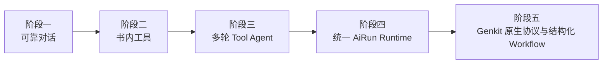
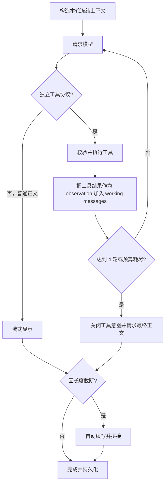

# 从模型对话到受控 Agent：开卷本书 AI 的实现演进

| | |
|---|---|
| **状态** | 历史实现基线 + Genkit 落地复盘（更新于 2026-08-10） |
| **代码基线** | `ba745865587` |
| **落地基线** | `1f0da2b3024`（完整迁移与验证记录） |
| **研究对象** | 本书 AI 对话的输入、上下文、流式输出、工具调用、多轮循环、持久化与下一代编排 |
| **产品规范** | [ai.md](../specs/ai.md) |
| **横向对照** | [ai-chat-anxreader-comparison.md](./ai-chat-anxreader-comparison.md) |
| **实施记录** | [ai-runtime-genkit-completion-plan.md](./ai-runtime-genkit-completion-plan.md) |

> 本文不是未来方案的需求清单，而是一份实现复盘。它记录开卷如何从“调用一次模型”逐步走到“手写工具 Agent”，每一步解决了什么问题、又产生了什么新问题。后续可以在此基础上改写为技术文章。

> **阅读提示：** 第 3–5 章复盘 `ba745865587` 的历史实现，第 6–7 章记录已经落地的统一运行时与 Genkit 迁移。旧 fenced、手写 Messages 对话 adapter 和对话 Provider 回退已删除；当前权威行为以 [ai.md](../specs/ai.md) 为准。

---

## 1. 一句话结论

这次演进并不是简单地“给聊天换一个框架”，而是连续完成了五次边界收敛：

> **从一次模型调用，走到由开卷掌握作品范围、运行状态和确定性工作流，Genkit 只承担供应商协议、原生工具调用、结构化输出与 trace 的受控 AI Runtime。**

最终形态仍是单 Agent：普通问答允许模型在只读工具中选择下一步；词典、翻译、大纲和知识图谱采用确定性 Workflow。开卷拥有 scope、权限、预算、取消、续写、checkpoint、存储、WebDAV 和 UI 状态，模型框架不能越过这些产品边界。

本文前半部分按 `ba745865587` 历史基线复盘前三阶段，后半部分记录统一运行时与 Genkit 迁移。阅读时应区分“当时为什么这样设计”和“最终落地为什么改变”。

---

## 2. 五个阶段的演进地图

| 阶段 | 触发问题 | 边界变化 | 阶段产物 | 里程碑 |
|------|----------|----------|----------|--------|
| 1. 可靠对话 | 模型 API 成功不等于产品回答成功 | 明确输入、流式终态、重试、续写与持久化 | Commercial chat pipeline | 汇入 `ba745865587` |
| 2. 书内工具 | 有限上下文无法支撑整本书问题 | 模型只提读取意图，App 验证并执行 | 五个只读工具 + fenced JSON | 汇入 `ba745865587` |
| 3. 多轮 Tool Agent | 一次检索不足以回答复杂问题 | 模型可依据 observation 继续选择工具 | 四轮行动—观察循环 | `ba745865587` |
| 4. 统一运行时 | 对话、语言、大纲、图谱各自管理状态 | App 统一 scope、事件、预算、取消与 checkpoint | `AiRunOrchestrator` / `AiRunState` | `41d35817cae`（运行时基础） |
| 5. Genkit 全迁移 | 文本工具协议与手写 Provider 成为重复基础设施 | Genkit 归一化模型协议，业务仍依赖 App 契约 | 原生工具 + 结构化 Workflow + trace | `41d35817cae`—`1f0da2b3024` |



五个阶段不是简单叠加依赖。可靠对话、作用域安全和行动—观察能力被保留；fenced JSON、旧 Provider 和分散运行状态则在新边界验证完成后被替换并删除。

---

## 3. 阶段一：从一次 API 调用到可靠对话

> **起点：** 用户发一句、模型回一句。
>
> **目标：** 即使发生流式中断、取消、超长输出或 App 重启，用户看到的回答与持久化状态仍然可信。
>
> **关键交付：** Provider 抽象、上下文预算、回答快照、终态、有限重试、自动续写与会话恢复。

### 3.1 最小模型调用看起来很简单

最原始的对话只有一条路径：

```text
用户输入
  → messages: [system, history, user]
  → POST /chat/completions
  → 读取回复文本
  → 显示
```

真正进入产品后，困难不在 `POST` 本身，而在请求前后的状态管理：

- system、历史、书籍正文和用户问题分别放在哪里；
- 历史消息太长时如何裁剪；
- 流式连接结束是否代表模型正常完成；
- 用户点击停止后，网络、工具和后续请求是否全部停止；
- 已显示部分文本后网络失败，能否安全重试；
- 模型因 token 上限截断时，如何保留并继续；
- App 被系统终止后，未完成消息是否会污染下一轮历史。

### 3.2 Provider 层：先隔离供应商协议

开卷使用 `AiProvider` 抽象三个基础动作：

```dart
abstract interface class AiProvider {
  Future<AiCompletionResult> complete(AiCompletionRequest request);
  Stream<AiStreamChunk> stream(AiCompletionRequest request);
  Future<List<AiModelInfo>> listModels();
}
```

这一阶段包括 OpenAI Compatible 与 Anthropic 协议。上层只认识统一的：

- `AiMessage`：system / user / assistant；
- `AiCompletionRequest`：消息、温度、输出预算、超时；
- `AiStreamChunk`：文本增量、是否终态、是否因长度截断；
- `AiCompletionResult`：完整文本与截断标记。

这个抽象解决“供应商格式不同”，但尚未表达工具调用、usage、reasoning、source 等结构化流事件。它是聊天传输层，不是 Agent 层。

### 3.3 输入：不是把整本书塞进 Prompt

每轮对话先构造一个轻量种子上下文：

```text
固定 system 规则
+ 书名 / 作者
+ 当前作品范围标签
+ 当前章节标题与有限正文
+ 当前选区
+ 目录标题
+ 裁剪后的有效历史
+ 用户问题
+ 可选联网结果
```

设计原则是“默认信息足够回答局部问题，更多正文按需读取”：

- 当前章最多保留约 1 万字符；
- 选区最多保留约 4 千字符；
- 历史只发送 completed 消息，失败、停止、pending 不进入模型历史；
- 单条历史与历史总量都有上限；
- 书名、正文、搜索结果和工具结果都放入 `untrusted_context` 边界，不能成为新的系统指令。

这一步决定了系统的安全边界：正文是数据，不是指令；作品范围由 App 决定，不由模型猜测。

### 3.4 输出：流式显示不等于收到字符串就拼接

Provider 输出的是文本 delta，`AiChatService` 对外输出的是“当前完整回答快照”。UI 每次收到新值就替换 `_streaming`，而不是盲目追加。

快照语义让服务层可以：

- 清除误显示的工具协议前缀；
- 修复工具调用后撤回临时文本；
- 自动续写后重新发出拼接完成的整条回答；
- 对续写首尾重叠做去重。

UI 将流式回答绑定到稳定 `turnId`，一轮内的 user/assistant 共享状态：

```text
pending → completed
        → failed
        → cancelled
```

生成期间按节流频率保存助手快照；正常完成、错误或停止时写入终态。重新打开 App 时，遗留的 pending 会转成 cancelled，并从未来模型历史中排除。

### 3.5 重试：只在用户还没看到文本前自动发生

短请求对 408、409、425、429、5xx、超时和网络故障做一次有限重试。

流式请求遵守更严格的原则：

```text
首个可见字符之前失败 → 可以安全重试一次
已经显示任何正文之后失败 → 不从头静默重试
```

原因是重新请求可能生成不同文本、重复工具调用和重复计费。已经显示的部分应保留，并明确进入失败或可重试状态。

### 3.6 截断：HTTP 200 也可能不是完整回答

模型可能以 OpenAI 的 `finish_reason=length` 或 Anthropic 的 `stop_reason=max_tokens` 结束。网络成功不代表内容完整。

这一阶段的方案会：

1. 保留已显示正文；
2. 把它作为 assistant 历史；
3. 请求模型只从中断处继续，不重复标题、表头或已完成段落；
4. 对两段首尾最多约 800 字符做精确重叠消除；
5. 拼回同一条助手消息；
6. 最多续写八轮，防止模型无限继续。

续写复用原问题、冻结作品范围和已得到的工具结果，不重新执行工具。

### 3.7 阶段小结：可靠性先于 Agent 能力

“调用模型”只占商业对话链路的一小部分。成熟对话至少需要：

- 明确输入边界；
- 明确流终态；
- 取消传播；
- 安全重试；
- 长输出续写；
- 会话状态与恢复；
- 用户可理解的错误。

这些能力即使以后换 Agent 框架，也仍然属于开卷的产品责任。

进入下一阶段的原因是：对话链路已经可靠，但模型仍然只能看到有限上下文，无法在几十万字正文中主动取得回答所需的证据。

---

## 4. 阶段二：从 Prompt 塞正文到受控书内工具

> **起点：** 当前章可以回答局部问题，整本书问题却缺少正文。
>
> **目标：** 不一次性上传整本书，让模型按需提出读取意图。
>
> **关键交付：** 五个只读工具、工具白名单、参数与字符预算、冻结作品范围、fenced JSON 最小协议。

### 4.1 为什么需要工具

本书 AI 面临一个矛盾：

- 不把整本书交给模型，模型无法回答全书问题；
- 把几十万到上百万字符一次性塞入 Prompt，成本高、超上下文，而且相关信息会被稀释。

工具调用把问题改成：先让模型判断缺什么，再由 App 提供有限、可验证的正文。

### 4.2 阶段产物：五个书内工具

| 工具 | 用途 |
|------|------|
| `get_toc` | 读取当前作用域的目录和稳定 section index |
| `get_current_chapter` | 读取本轮冻结的当前章节 |
| `get_chapter` | 按目录中的 1-based section index 读取一节 |
| `search_book` | 在当前作用域正文中检索关键词并打包附近文本 |
| `sample_book` | 对整本或当前作品做均匀取样，支持概括、主题和大纲 |

`AiBookChatToolHost` 是工具执行边界。它只依赖正文缓存、冻结的本轮上下文与作品范围，不依赖 UI Controller。

即使阅读引擎已经接收范围参数，Host 仍会再次在本地收窄正文，避免合订本相邻作品泄漏。

### 4.3 为什么最初使用 fenced JSON

这一阶段的工具协议是：

````text
```kaijuan_tools
[{"name":"get_chapter","sectionIndex":8}]
```
````

选择文本协议的历史价值：

- 不依赖某一家供应商的 Function Calling 格式；
- OpenAI Compatible、Anthropic 和能力较弱的兼容模型都能使用；
- 解析器、白名单和工具 Host 都是纯 Dart，容易单测；
- 不需要引入 LangChain 等大框架。

### 4.4 文本协议带来的新问题

文本模拟工具调用也产生了协议层风险：

- 模型可能在工具块前写解释文字；
- Markdown 流可能只收到 `` ` ``、`` ```kaijuan_t `` 等半个协议头；
- JSON 可能在 token 上限处截断；
- 模型可能把工具块嵌入普通回答；
- 普通书中文字可能恰好包含相似代码块；
- 工具协议不能直接承载标准的 tool call ID、并行调用状态和 usage。

因此阶段二要求：只有“整条回复完全是一个合法、独立的 `kaijuan_tools` 围栏”才执行。嵌入正文、残缺围栏和未知工具一律不执行。

如果首轮工具块损坏，App 只允许模型做一次受控重述：要么输出完整独立工具块，要么改为普通正文。再次失败则明确报错，不猜测残缺 JSON。

### 4.5 工具层的确定性控制

模型只能提出请求，App 保留最终控制：

- 工具名必须在白名单中；
- 单轮最多解析六个调用；
- 重复签名去重；
- 每个工具的 `maxChars` 被本地上下限钳制；
- 每轮和整轮工具上下文都有字符预算；
- section index 必须来自当前目录空间；
- 工具异常转换为 observation，而不是让模型直接执行任意代码；
- 停止按钮使用同一个 cancel token 中断搜索、模型和工具。

### 4.6 阶段小结：工具是权限收缩

工具调用不是“让模型获得权限”，而是：

> 模型提出结构化意图，宿主应用验证、限制并执行，再把结果作为不可信观察材料返回。

模型负责选择信息，App 负责边界、权限和确定性。

进入下一阶段的原因是：一次工具调用只能完成固定的一问一取；复杂阅读问题往往需要先看目录、再搜索、再读取具体章节，模型必须能根据新观察调整下一步。

---

## 5. 阶段三：从一次工具调用到多轮 Tool Agent

> **起点：** 模型可以调用工具，但无法根据工具结果继续检索。
>
> **目标：** 允许有限的行动—观察—再决策，同时不引入自由自治。
>
> **关键交付：** 最多四轮工具循环、working messages、协议修复、工具预算、停止传播与最终回答阶段。

### 5.1 一次工具调用为什么不够

例如用户问“斯内普在前七部中的态度如何变化”，模型可能需要：

1. 先读目录；
2. 搜索“斯内普”；
3. 根据命中读取具体章节；
4. 再次检索相关人物；
5. 最后组织回答。

工具只能提供能力，多轮循环才让模型根据新证据调整下一步行动。

### 5.2 阶段产物：多轮循环



每次循环都在同一个 `working messages` 上追加：

```text
assistant: 完整工具请求
user: <untrusted_tool_results>工具观察</untrusted_tool_results>
```

这就是 Agent 的核心“行动—观察—再决策”。它与 ReAct 思路相近，但开卷不要求或展示模型的思维过程，只处理工具行动和最终回答。

### 5.3 为什么它已经是 Agent

普通工作流由程序预先决定下一步；阶段三的对话中，下一步由模型根据问题和 observation 动态选择：

- 直接回答；
- 调目录；
- 搜书；
- 取某章；
- 取样整本；
- 获得结果后继续调用其他工具。

因此它不是“带几个函数的聊天”，而是一个轻量 Tool Agent。

### 5.4 为什么它仍然是“手写原始 Agent”

这一阶段的 Agent 能力集中在 `AiChatService.streamReply` 的一个专用循环中，尚未抽象成通用运行时：

- 工具调用通过文本围栏模拟，而非 Provider 原生结构；
- UI 主要收到 `Stream<String>` 和一个独立状态回调；
- 没有统一的 `RunStarted / ToolStarted / ToolCompleted / Usage / Finished` 事件；
- 没有通用 Tool Registry、middleware 和 hook；
- 没有每一步的统一 trace、token 与费用统计；
- 没有可复用 checkpoint 图；
- 大纲、知识图谱、翻译没有共用同一个编排器；
- 任务路由与工作流定义仍散在各服务和 Controller。

“原始”在这里不是贬义。它意味着实现直接、依赖少、边界清楚、容易测试；代价是随着任务变多，重复状态管理和跨端一致性会越来越难。

### 5.5 阶段三的完整调用链

```text
book_ai_chat_sheet.dart
  1. 创建 turnId，写入 pending user 消息
  2. 冻结当前作品 workKey 与 CancelToken
  3. 可选执行联网搜索
  4. 加载当前章、选区、目录和作品范围
  5. 调 BookReaderController.streamBookChat

book_reader_controller.dart
  6. 确保书籍结构与作品候选已解析
  7. 创建 AiBookChatToolHost
  8. 调 AiChatService.streamReply

ai_chat_service.dart
  9. 构造 system / history / untrusted context
 10. 最多四轮模型—工具循环
 11. 工具结束后流式生成最终正文
 12. 截断时最多八轮自动续写

ai_provider.dart + concrete providers
 13. 转换 OpenAI Compatible / Anthropic 请求与 SSE
 14. 识别 finish reason、异常、取消和终态

book_ai_chat_sheet.dart
 15. 更新回答快照和可见状态
 16. 定期保存 pending assistant checkpoint
 17. 完成、失败或取消时原子写入终态
 18. 完成后另发短请求生成一条内容相关追问
```

### 5.6 阶段三的优势

- 本地 BYOK，不需要开卷服务器代理用户正文；
- 多供应商共用同一产品逻辑；
- 当前章种子让简单问题零工具往返；
- 工具只读、范围受控，适合本地阅读器；
- contentHash 隔离会话，重导同一文件仍可续聊；
- 失败关闭，残缺工具协议不会被执行；
- 单元测试可以直接覆盖协议、预算、作用域和循环。

### 5.7 阶段三留下的结构债

- 文本工具协议容易受模型输出格式和 token 截断影响；
- `Stream<String>` 难以完整表达复杂运行过程；
- 图谱等长任务与对话的状态模型不一致；
- 可观测性依赖日志，难以按一次 run 查看完整路径；
- 工具轮次、模型调用、续写和追问的 usage 没有统一聚合；
- 将来加入写操作工具时，缺少统一审批与权限中间件；
- 移动端被系统挂起后只能恢复 checkpoint，无法保证本地网络任务继续运行。

### 5.8 阶段小结：Agent 已经出现，Runtime 仍未形成

到这一阶段，开卷已经具备 Agent 的最小本质：模型能够根据 observation 动态决定下一步。但对话循环、工具状态、续写、图谱进度和 Provider usage 仍散落在不同服务中。

进入下一阶段的原因不再是“模型不会调用工具”，而是产品开始需要统一回答：一次 AI 任务现在处于什么状态、用了多少次模型、是否可取消、失败后能否恢复、UI 应该显示什么。

---

## 6. 阶段四：从专用循环到开卷统一运行时

> **起点：** 各 AI 功能能够工作，但分别维护取消、进度、终态和持久化。
>
> **目标：** 在接入任何框架之前，先让开卷拥有稳定、可替换的运行时边界。
>
> **关键交付：** `AiRunOrchestrator`、`AiRunEvent`、`AiRunState`、统一预算、scope、usage、取消、超时与 checkpoint。

### 6.1 阶段决策：统一状态，不增加自治

这一阶段没有让多个 Agent 自由讨论，而是把原先隐含在各个服务里的运行状态显式化：

```text
确定性的产品编排
  + 模型可选择的只读工具
  + 统一运行事件
  + 可恢复 checkpoint
  + 可观测性与预算
```

开卷仍应是单 Agent。大纲、图谱、翻译使用确定性工作流；只有普通问答在受控范围内让模型动态调用工具。

### 6.2 落地边界：开卷编排器 + 可替换适配层

```text
AiRunOrchestrator（开卷拥有）
├─ task routing
├─ book/work scope
├─ run state and checkpoint
├─ cancellation / timeout / budget
├─ continuation
├─ persistence
└─ UI events
        ↓
GenkitAdapter（可替换基础设施）
├─ provider normalization
├─ native function calling
├─ tool schema
├─ structured output
└─ trace / developer tooling
```

后续接入的 Genkit 不直接拥有：

- 当前书和当前作品的选择；
- 是否允许回退整个文件；
- 图谱覆盖策略；
- 会话文件与 WebDAV 格式；
- UI 的移动端、平板和桌面状态；
- 自动续写的产品上限；
- 用户费用与隐私策略。

### 6.3 统一运行事件落地

新接口不再只返回字符串：

```dart
sealed class AiRunEvent {}

final class RunStarted extends AiRunEvent {}
final class ScopeResolved extends AiRunEvent {}
final class ModelStarted extends AiRunEvent {}
final class TextDelta extends AiRunEvent {}
final class ToolCallStarted extends AiRunEvent {}
final class ToolCallCompleted extends AiRunEvent {}
final class ContinuationStarted extends AiRunEvent {}
final class UsageUpdated extends AiRunEvent {}
final class ProgressUpdated extends AiRunEvent {}
final class RunCompleted extends AiRunEvent {}
final class RunFailed extends AiRunEvent {}
final class RunCancelled extends AiRunEvent {}
```

UI 只投影这些事件。这样手机、平板、折叠屏与桌面不会各自推测“后台到底在搜索、生成还是已经失败”。

### 6.4 不同任务使用不同编排模式

| 任务 | 编排方式 | 模型自主程度 |
|------|----------|--------------|
| 本书问答 | 受控 Tool Agent | 可选择只读工具，不能改变范围和预算 |
| 大纲 | 分批摘要 → 汇总 → 覆盖校验 | 步骤固定 |
| 知识图谱 | 分块抽取 → 合并 → 去重 → 质量校验 → 原子提交 | 步骤固定，局部结构化生成 |
| 词典 / 选区翻译 | 无工具单回合生成 → 终态校验 → 系统能力 fallback | 步骤固定 |
| 联网补充 | 搜索 → 来源整理 → 回答 | App 决定是否联网和引用规则 |

### 6.5 分阶段实施与实际选择

统一运行时先定义开卷自己的产品契约，再让各功能逐步接入：

1. 建立 `AiRunState`、`AiRunEvent` 与 `AiRunOrchestrator`，由开卷统一运行状态、预算、取消和终态。
2. 用 `AiRunDescriptor` 和 `AiRunScope` 冻结 task、`contentHash`、`workKey` 与展示标签。
3. 将模型调用数、工具轮数、续写轮数、工具正文字符数和总时长纳入同一预算。
4. 将停止、Stream 取消和超时汇入同一个 `CancelToken`，只产生一个明确终态。
5. 为大纲、图谱等长任务保留版本化 checkpoint seam，业务 payload 仍由工作流解释。
6. 定义不含任何 Genkit 类型的 `AiModelAdapter` / `AiStructuredOutputAdapter`，为下一阶段替换模型基础设施留下稳定接口。

这一阶段首先解决状态所有权，没有要求所有功能同时改写，也没有让 UI 或数据库依赖具体模型 SDK。

### 6.6 阶段小结：先稳定开卷边界，再替换模型基础设施

统一运行时解决了“谁拥有任务”的问题：不是 Provider，也不是 Genkit，而是开卷。此后模型 SDK 可以升级或替换，UI、数据库、作品范围和恢复格式不需要跟随变化。

进入下一阶段后，迁移重点才从产品状态转到模型基础设施：替换 fenced JSON、手写供应商生成协议和提示词伪结构化输出。

---

## 7. 阶段五：Genkit 原生协议与全工作流迁移

> **起点：** 开卷已经拥有统一运行时，但模型传输、文本工具协议和多个结构化解析器仍是自维护基础设施。
>
> **目标：** 利用 Genkit 统一供应商协议、原生工具、结构化输出与 trace，同时不让框架侵入产品边界。
>
> **关键交付：** OpenAI Compatible / Anthropic adapter、原生 Function Calling / Tool Use、Schemantic schema、`AiWorkflowModelSession`、旧 Provider 删除与完整验证。

### 7.1 阶段原则：引入框架，但不交出控制权

Genkit adapter 只执行一个模型回合，开卷继续控制外部循环。没有采用 Genkit Agent session、远程 flow、强制后端或多 Agent；本地 BYOK、五端与无强制服务器原则保持不变。

迁移后最直观的体验变化之一，是同一个模型在合集、套装书或多作品 EPUB 中，更能答对“我现在读的是哪一本、哪一章”。这并不表示 Genkit 改变了模型参数或赋予模型新的文学知识。

更准确的因果链是：

```text
确定性识别出版物结构
  → 将阅读位置映射到当前作品
  → 冻结 contentHash / workKey / 当前章
  → 所有工具共享同一作品范围
  → 通过原生工具协议取得可关联的证据
  → 模型只需基于证据回答，不再猜测数据边界
```

Genkit 主要改善模型协议、结构化历史、供应商归一化和 trace；合集准确率提升最大的来源，则是开卷自有的作品范围识别、冻结和二次裁剪。两者缺一不可，但不应把全部收益归因于框架。

### 7.2 旧链路为什么已有 scope 仍然不够稳定

`ba745865587` 已经具备合集识别、冻结作品范围和 `AiBookChatToolHost` 二次裁剪。因此不能把迁移前实现描述成“让模型在整个合集里随便猜”。真正不稳定的是模型如何表达取证动作，以及 App 如何把 observation 送回模型：

- 工具名称和参数藏在 fenced JSON 文本中，而不是模型 API 的正式 tool call；
- 模型可能输出半个 fence、残缺 JSON、解释文字或正文与工具块混写；
- App 必须先猜测流式前缀是否会变成工具协议，再决定隐藏、执行或当正文展示；
- 工具 observation 作为拼接消息回到 working messages，没有供应商原生 call ID；
- OpenAI Compatible 与 Anthropic 的工具能力无法在同一 App 契约上直接归一；
- 协议损坏需要额外格式修复轮次，增加延迟、token 和再次失败的机会。

结果是：App 已经把小说 B 的正文边界控制正确，模型却可能没有成功调用搜索或章节工具，转而只根据当前章和参数知识直接作答。用户感受到的“没那么准”，很多时候不是检索范围错误，而是证据获取协议不够稳定。

### 7.3 被完整保留的基础：App 确定当前作品

`AiBookStructureResolver` 使用阅读器提取的导航层级、spine 标题、章节/分卷标题和补充材料边界，将出版物确定性分类为：

- `singleWork`：普通单本作品；
- `segmentedSingleWork`：同一作品的多卷或多部分；
- `multiWorkOmnibus`：多部独立作品组成的合集；
- `uncertain`：证据不足，不能安全确定范围。

解析过程不调用模型。只有具有明确物理章节边界的独立作品才成为可自动选择的 `scopedWorks`；无法唯一映射的逻辑作品保持 `uncertain`，不会被包装成一个看似可靠的当前作品。

共享的 `AiBookStructureSession` 缓存解析结果，供对话、大纲和知识图谱使用，避免不同功能分别判断同一文件后得到不同作品边界。阅读位置随后映射到具体作品，并在一次运行开始时冻结为 `contentHash + workKey`。

这套 scope 能力在 Genkit 迁移前已经存在，迁移时被作为不可回归的产品边界保留，并正式进入 `AiRunScope`。Genkit 不识别 EPUB，也不决定当前作品；它只是让模型更可靠地使用作用域内的工具。

### 7.4 作用域不变量：提示词、工具和存储必须一致

当前作品确定后，系统不只是提醒模型“请只看小说 B”，而是把模型能够读取的数据实际裁到小说 B：

1. 当前上下文使用作品标题作为 `Title`，同时将文件标题标为 `Part of collection`；
2. 目录只保留作品范围内的条目；
3. `get_toc`、`get_chapter`、`search_book`、`sample_book` 使用同一 ranged corpus；
4. `get_current_chapter` 使用提问瞬间冻结的正文，运行中翻页不会改变语境；
5. 阅读引擎按范围加载后，`AiBookChatToolHost` 再本地裁剪一次，防止不符合约定的引擎泄漏相邻作品；
6. 会话、大纲和图谱按 `contentHash / workKey` 隔离与持久化。

因此“这本书 / 整本书 / 全书”在合集场景下被明确解释为当前作品，而不是整份合集。更重要的是，这个语义同时存在于 Prompt、目录、正文和工具索引空间中，不再只是一个可能被数据反驳的软提示。

### 7.5 原生工具调用减少协议噪声

旧实现要求模型生成一个独立的 `kaijuan_tools` fenced JSON 块。它实现了跨 Provider 的最小 Agent，但也需要处理半个 fence、残缺 JSON、正文与工具块混写、格式修复和 token 截断。

迁移后，模型交互使用正式结构：

```text
assistant tool call
  ├─ callId
  ├─ tool name
  └─ schema-checked arguments

tool result
  ├─ matching callId
  ├─ tool name
  └─ bounded observation
```

Genkit adapter 将 OpenAI Compatible Function Calling 与 Anthropic Tool Use 归一为开卷自己的 `AiModelToolCall` / `AiModelToolResult`。开卷仍验证工具名、参数、轮数、字符预算、取消和作用域，再决定是否执行；框架没有获得正文权限。

正式的 assistant → tool → assistant 历史让模型更容易理解“哪个观察回答了哪个动作”，也更接近支持工具模型的原生训练与接口形式。它减少的是协议噪声和失败概率，而不是替模型做事实判断。

### 7.6 统一运行时消除了半成功状态

`AiRunOrchestrator` 现在独立于供应商执行以下约束：

- 本书对话最多四轮工具调用，并限制模型调用、工具结果字符数和总时长；
- 停止、关闭和 Stream 消费取消传播到模型与工具；
- 空回答、缺少终态、无效最终工具调用明确失败；
- 被截断的工具请求不执行，避免拿半组参数查询正文；
- 正文因 token 上限截断时最多自动续写八轮，并对首尾重复内容去重；
- `AiRunEvent` / `AiRunState` 统一表达 scope、模型、工具、usage、进度和终态；
- 长工作流可以写 checkpoint，失败不会把部分结果伪装成完整成果。

这些机制未必让一次成功回答更有文采，但会减少“看起来生成了、实际证据链不完整”的结果，所以产品层面的稳定准确率会提高。

### 7.7 大纲与知识图谱的提升来自确定性 Workflow

普通对话保留受控 Tool Agent：模型可以决定下一步查目录、搜正文还是取章节。大纲和知识图谱则没有被改造成自由 Agent，而是使用程序定义的固定步骤。

- 大纲：分批摘要 → 结构化汇总 → 覆盖与数量校验；
- 图谱：分章抽取 → gleaning → 合并去重 → 实体刷新 → 谱系/关系审查 → 质量门 → checkpoint；
- 词典与翻译：无工具单回合流式生成，保留系统能力 fallback；
- 所有结构化模型输出通过 Schemantic schema 和业务语义两层校验。

这说明框架价值并不等于“所有功能 Agent 化”。对步骤可以预先描述的任务，确定性 Workflow 更节省 token、更易恢复、更容易测试，也能阻止格式正确但业务含义错误的数据直接进入缓存。

### 7.8 阶段五的内部迁移批次

阶段五仍按可回滚的小步推进，没有同时改写全部 AI 功能：

| 批次 | 改造内容 | 验收重点 |
|------|----------|----------|
| 5A. Adapter 与对话 | 建立 OpenAI Compatible / Anthropic adapter；本书对话切到原生工具；接入 `AiRunEvent` | 流式终态、工具 call ID、四轮上限、取消、续写、合集 scope 不回归 |
| 5B. 语言与大纲 | 词典/翻译切到无工具 `streamTurn`；大纲切到 Schemantic `completeJson` | 空输出、截断、目标语言、批次覆盖、缩小批次重试 |
| 5C. 知识图谱 | 抽取、gleaning、实体刷新、谱系与合并审查分别使用独立 schema | 稳定 ID、证据、关系方向、质量门、增量 checkpoint |
| 5D. 控制面收口 | 模型列表拆为只读 `AiModelCatalog`；连接测试使用 adapter | OpenAI / Anthropic headers、取消、错误映射、本地模型 |
| 5E. 删除与验证 | 删除旧 Provider、fenced 解析、completion/stream 双栈；执行 trace 与完整测试 | 无遗留调用者、build/analyze、559/559 测试通过 |

每一批只替换模型 I/O 或运行状态，不改书籍 scope、缓存格式、WebDAV schema 和既有图谱业务算法。这个边界使问题可以按层定位：协议失败属于 adapter，结构错误属于 schema，事实或范围错误属于业务校验与 corpus。

### 7.9 迁移前后对照

| 环节 | `ba745865587` 历史实现 | Genkit 落地实现 | 主要收益来源 |
|------|------------------------|----------------|----------------|
| 模型边界 | `AiProvider` 同时承担聊天传输与部分重试 | `AiModelAdapter` 单回合契约，Genkit SDK 隔离在 adapter | 开卷 + Genkit |
| 工具协议 | fenced JSON 模拟 Function Calling | 原生 Function Calling / Anthropic Tool Use | Genkit adapter |
| 工具历史 | 文本请求 + 文本 observation | call ID 关联的 tool call / result | Genkit adapter |
| 合集判断 | 确定性结构解析与共享 Session | 原样保留，并正式写入 `AiRunScope` | 开卷（迁移不变量） |
| 工具正文 | ranged corpus + Host 二次裁剪 | 原样保留，通过原生 tool result 回传 | 开卷（迁移不变量） |
| 运行状态 | 回答快照与工具回调分离 | `AiRunEvent` / `AiRunState` | 开卷 |
| 预算与取消 | 各服务分别实现 | `AiRunOrchestrator` 统一执行 | 开卷 |
| 大纲/图谱格式 | 提示模型输出 JSON，再手动恢复和解析 | Schemantic schema 的 `completeJson` + 业务校验 | Genkit + 开卷 |
| Provider | 手写 OpenAI Compatible / Anthropic 生成链路 | Genkit OpenAI / Anthropic adapter，App 契约不变 | Genkit |
| 可观测性 | 分散日志 | Genkit CLI trace + App run events | Genkit + 开卷 |

### 7.10 不能过度归因于 Genkit

当前实现没有因为迁移自动获得向量数据库、Embedding、云端 RAG、多 Agent 或更大的模型上下文。书内检索仍主要依靠开卷本地章节切分、关键词命中、相关片段打包和均匀取样。

更准确的总结是：

> 旧系统已经由开卷确定书、作品、章节和可见正文，但模型仍要用脆弱的文本协议表达取证意图；新系统保留同一 scope，把取证升级为 Genkit 归一化的正式工具调用和结果历史。

因此用户会主观感到“上了框架以后模型更聪明”，客观上是原有确定性边界终于通过更可靠的工具协议充分发挥作用：模型更可能真正取得相关章节，而不是在工具协议损坏后退回猜测。

### 7.11 仍然存在的边界与后续评估

以下出版物仍可能无法自动建立可靠作品范围：

- 整个合集正文位于一个巨大 spine 文件；
- EPUB 导航层级被制作方压平或本身错误；
- 多部作品标题与普通章节标题无法区分；
- 当前 locator 只能定位物理 spine，不能定位其中的逻辑子作品。

系统会将这类情况标为 `uncertain`。后续更值得投入的方向不是让模型自由猜测，而是增加当前作品确认/切换、记录人工确认范围，并建立一组真实合集 EPUB 的范围识别与问答评测集。

文章或产品评估应分别度量：作品范围识别正确率、工具选择成功率、工具证据命中率、最终答案事实正确率、取消/截断/恢复成功率。只比较最终回答的主观观感，会掩盖提升究竟来自模型、检索、协议还是运行时。

### 7.12 阶段小结：框架提升的是协议可靠性，产品架构提升的是答案边界

这一阶段让两类能力真正咬合：Genkit 减少工具与结构化输出的协议噪声；开卷既有的确定性 scope 保证模型只能接触当前作品的目录、章节、搜索和取样。最终体验像是“模型变聪明了”，本质上是模型更稳定地取得了正确范围内的证据。

迁移完成后，`dart run build_runner build`、`flutter analyze` 和完整 `flutter test` 均通过，测试结果为 **559 / 559**；Genkit CLI smoke 同时验证了纯文本、结构化输出与 trace span。

---

## 8. 三组容易混淆的概念

### 8.1 Chat、Tool Calling、Agent

```text
Chat：用户说一句，模型回答一句

Tool Calling：模型可以提出一次结构化函数请求

Agent：模型获得观察结果后，可以继续决定下一步行动，直到完成或达到限制
```

开卷当前已经越过 Tool Calling，进入了 Agent 阶段。

### 8.2 Workflow 与 Agent

```text
Workflow：程序决定下一步
Agent：模型决定下一步
```

商业产品通常不是二选一，而是“Workflow 外壳包住有限 Agent”。

### 8.3 Agent 框架与多 Agent

Agent 框架提供模型、工具、状态、事件、追踪与持久化抽象；使用 Agent 框架不等于必须使用多个 Agent。

开卷当前没有多 Agent 需求。多 Agent 会增加 token、延迟、不可复现性和移动端状态复杂度，而阅读问答并没有相应收益。

---

## 9. 适合技术文章的叙事主线

未来改写文章时，可以围绕五次认知变化展开。

### 第一篇：模型 API 不是对话产品

核心观点：请求成功和回答成功是两件事。

可写案例：

- SSE EOF 不等于正常完成；
- `finish_reason=length` 仍然是 HTTP 200；
- 为什么显示文本后不能静默重试；
- 如何把多次续写表现成一条回答；
- pending 消息为什么不能进入下一轮历史。

### 第二篇：工具不是能力开放，而是权限收缩

核心观点：模型只提交意图，App 才执行能力。

可写案例：

- 为什么不把整本书塞入 Prompt；
- 五个书内工具如何覆盖局部与全书问题；
- 作品作用域为什么必须由阅读器冻结；
- 为什么工具结果也是不可信上下文；
- fenced JSON 的优点和代价。

### 第三篇：手写一个最小 Tool Agent

核心观点：Agent 的最小本质不是“会思考”，而是行动—观察—再决策循环。

可写案例：

- 四轮工具循环；
- 工具协议前缀的流式判别；
- 残缺工具块的受控修复；
- 预算、去重、取消和失败关闭；
- 为什么阶段三已经是 Agent，又为什么仍叫手写原始 Agent。

### 第四篇：何时应该引入 Agent 框架

核心观点：当难点从“让模型调用工具”转向“管理大量运行状态”时，框架才开始产生价值。

引入框架的信号：

- 多个 AI 功能重复实现取消、重试、进度和持久化；
- UI 需要展示模型、工具、续写、usage 等结构化事件；
- 需要 trace、评估、成本统计和 checkpoint；
- 需要原生 Function Calling 与多供应商归一化；
- 需要写操作审批和通用中间件。

结尾可以落在开卷的选择：不是追求更自治，而是追求更可控、更可恢复、更可观察。

### 第五篇：为什么换框架后，同一个模型像是变聪明了

核心观点：产品准确率不仅取决于模型能力，更取决于系统是否先消除了问题中的数据边界歧义。

可写案例：

- 合集里的“这一本”为什么是一个 scope 问题，而不是 Prompt 技巧；
- 如何从 EPUB 导航与 spine 确定当前作品；
- 为什么目录、搜索、章节和取样必须共享同一索引空间；
- fenced JSON 与原生工具协议对行动—观察链路的影响；
- 如何区分 Genkit 的协议收益与开卷编排器的产品收益；
- 为什么 `uncertain` 比自信地猜错更有工程价值。

---

## 10. 代码导航

| 层 | 文件 | 职责 |
|----|------|------|
| UI | `lib/presentation/widgets/reader/book_ai_chat_sheet.dart` | 输入、联网、等待态、流式快照、checkpoint、终态和追问 |
| Controller | `lib/presentation/controllers/book_reader_controller.dart` | 当前章、选区、作品范围、运行事件记录与工具 Host 装配 |
| 运行模型 | `lib/ai/ai_run.dart` | `AiRunEvent`、`AiRunState`、scope、usage 与终态 |
| 运行编排 | `lib/ai/ai_run_orchestrator.dart` | 预算、取消、超时、事件顺序和 checkpoint 边界 |
| 模型契约 | `lib/ai/ai_model_adapter.dart` | 单回合流式生成、原生工具与结构化输出的 App 自有类型 |
| Adapter 工厂 | `lib/ai/ai_model_adapter_factory.dart` | Provider 配置到 Genkit adapter 的唯一装配入口 |
| Genkit adapters | `lib/ai/adapters/genkit_*_model_adapter.dart` | OpenAI Compatible / Anthropic 归一化、流式、工具与结构化输出 |
| 对话服务 | `lib/ai/ai_chat_service.dart` | Prompt、原生工具循环、正文流与自动续写 |
| 工具定义 | `lib/ai/ai_chat_tools.dart` | 五个只读工具的 schema、白名单、预算与执行 |
| 工具宿主 | `lib/ai/ai_book_chat_tool_host.dart` | 目录、章节、搜索、取样与二次范围收窄 |
| 正文缓存 | `lib/ai/ai_book_corpus.dart` | 阅读器正文抽取缓存 |
| 书籍结构 | `lib/ai/ai_book_structure.dart`、`ai_book_structure_session.dart` | 单本、分部、合集、不确定状态与共享作品范围 |
| 工作流会话 | `lib/ai/ai_workflow_model_session.dart` | 语言、大纲和图谱的 adapter 生命周期、调用数与 usage |
| 结构化 schema | `lib/ai/schemas/ai_workflow_schemas.dart` | 大纲和图谱各步骤的 Schemantic schema |
| 语言服务 | `lib/ai/ai_language_service.dart` | 词典与选区翻译的无工具流式生成 |
| 大纲服务 | `lib/ai/ai_outline.dart` | 分批摘要、结构化汇总与覆盖校验 |
| 图谱服务 | `lib/ai/ai_graph_service.dart` | 分章抽取、合并审查、质量门与 checkpoint |
| 模型目录 | `lib/ai/ai_model_catalog.dart` | 独立只读 `/models` 控制面，不参与生成 |
| 会话模型 | `lib/ai/ai_chat.dart` | 消息、turnId、状态、按作品隔离 |
| 会话状态 | `lib/ai/ai_chat_session_ops.dart` | 恢复 pending、追加和终态转换 |
| 会话存储 | `lib/ai/ai_chat_store.dart` | contentHash JSON、临时文件、备份恢复 |
| Smoke / trace | `tool/ai_genkit_smoke.dart` | 无凭据本地协议 smoke 与 Genkit trace |
| 测试 | `test/ai_*_test.dart`、`test/genkit_*_test.dart` 等 | adapter、工具、循环、作用域、工作流、取消和存储 |

旧 `ai_provider.dart`、`openai_compatible_provider.dart`、`anthropic_provider.dart` 和 fenced 工具解析实现只属于本文的历史基线，当前仓库已删除。

---

## 11. 当前阶段的定义

截至落地基线 `1f0da2b3024`：

- 阶段一“商业对话基础链路”已具备主要闭环；
- 阶段二“书内工具调用”已由 fenced JSON 升级为原生协议；
- 阶段三“多轮 Tool Agent”仍由开卷确定性控制，不引入多 Agent 或自由自治；
- 阶段四“开卷统一 AiRun Runtime”已完成；
- 阶段五“Genkit adapter 与全工作流迁移”已完成；
- 词典、选区翻译、大纲、知识图谱和连接测试已迁移到统一模型契约；
- 旧 Provider 生成双栈与协议回退已删除；
- `dart run build_runner build`、`flutter analyze` 与完整 `flutter test` 已通过，测试结果为 **559 / 559**；
- Genkit CLI 本地 smoke 已验证纯文本、结构化输出与 trace span。

后续工作应从“框架能否工作”转向真实阅读质量评估：用固定书目、固定问题和固定模型，分别记录 scope、工具证据、最终答案、延迟与失败恢复，避免只凭一次主观体验判断模型或框架质量。
