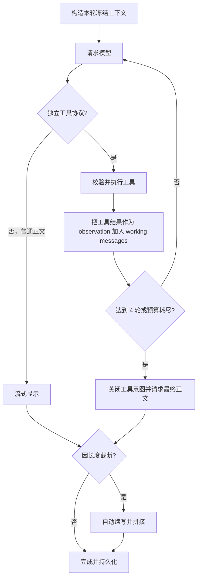

# 从模型对话到受控 Agent：开卷本书 AI 的实现演进

| | |
|---|---|
| **状态** | 当前实现基线（2026-08-09） |
| **代码基线** | `ba745865587` |
| **研究对象** | 本书 AI 对话的输入、上下文、流式输出、工具调用、多轮循环、持久化与下一代编排 |
| **产品规范** | [ai.md](../specs/ai.md) |
| **横向对照** | [ai-chat-anxreader-comparison.md](./ai-chat-anxreader-comparison.md) |

> 本文不是未来方案的需求清单，而是一份实现复盘。它记录开卷如何从“调用一次模型”逐步走到“手写工具 Agent”，每一步解决了什么问题、又产生了什么新问题。后续可以在此基础上改写为技术文章。

---

## 1. 一句话结论

开卷当前的本书对话已经不是普通聊天，而是一个：

> **单 Agent、手写 ReAct 风格行动—观察循环、以 fenced JSON 模拟 Function Calling、由 App 严格控制书籍作用域的轻量 Tool Agent。**

它已经具备 Agent 的核心行为：模型可以根据问题决定是否调用工具，App 执行工具并把观察结果送回模型，模型可以继续调用工具或给出最终答案。

它还不是通用 Agent Runtime：任务状态、工具事件、续写、持久化和不同 AI 功能尚未收敛成统一编排模型；大纲、知识图谱、翻译仍各有自己的服务流程。

---

## 2. 四个阶段的演进地图

| 阶段 | 核心问题 | 关键实现 | 系统性质 |
|------|----------|----------|----------|
| 1. 普通模型对话 | 怎么正确发送上下文、流式显示、处理中断与历史 | Provider 抽象、消息构造、流式终态、重试、自动续写、会话存储 | Chat pipeline |
| 2. 工具调用 | 模型看不到整本书，怎么按需取得可信正文 | 五个书内工具、自定义 JSON 协议、工具白名单与预算 | Tool-augmented chat |
| 3. 多轮 Agent Loop | 一次工具调用不够，怎么让模型反复检索后作答 | 最多四轮行动—观察循环、协议修复、冻结作用域 | Hand-written Tool Agent |
| 4. Agent 框架化 | 多任务、状态、工具、追踪如何形成统一运行时 | 计划采用开卷编排器 + Genkit 适配层 | Controlled agent runtime |

四个阶段不是互相替换。后一阶段保留前一阶段的基础能力，并在其上增加新的控制层。

---

## 3. 阶段一：普通的模型对话

### 3.1 最小模型调用看起来很简单

最原始的对话只有一条路径：

```text
用户输入
  → messages: [system, history, user]
  → POST /chat/completions
  → 读取回复文本
  → 显示
```

真正进入产品后，困难不在 `POST` 本身，而在请求前后的状态管理：

- system、历史、书籍正文和用户问题分别放在哪里；
- 历史消息太长时如何裁剪；
- 流式连接结束是否代表模型正常完成；
- 用户点击停止后，网络、工具和后续请求是否全部停止；
- 已显示部分文本后网络失败，能否安全重试；
- 模型因 token 上限截断时，如何保留并继续；
- App 被系统终止后，未完成消息是否会污染下一轮历史。

### 3.2 Provider 层：先隔离供应商协议

开卷使用 `AiProvider` 抽象三个基础动作：

```dart
abstract interface class AiProvider {
  Future<AiCompletionResult> complete(AiCompletionRequest request);
  Stream<AiStreamChunk> stream(AiCompletionRequest request);
  Future<List<AiModelInfo>> listModels();
}
```

当前实现包括 OpenAI Compatible 与 Anthropic 协议。上层只认识统一的：

- `AiMessage`：system / user / assistant；
- `AiCompletionRequest`：消息、温度、输出预算、超时；
- `AiStreamChunk`：文本增量、是否终态、是否因长度截断；
- `AiCompletionResult`：完整文本与截断标记。

这个抽象解决“供应商格式不同”，但尚未表达工具调用、usage、reasoning、source 等结构化流事件。它是聊天传输层，不是 Agent 层。

### 3.3 输入：不是把整本书塞进 Prompt

每轮对话先构造一个轻量种子上下文：

```text
固定 system 规则
+ 书名 / 作者
+ 当前作品范围标签
+ 当前章节标题与有限正文
+ 当前选区
+ 目录标题
+ 裁剪后的有效历史
+ 用户问题
+ 可选联网结果
```

设计原则是“默认信息足够回答局部问题，更多正文按需读取”：

- 当前章最多保留约 1 万字符；
- 选区最多保留约 4 千字符；
- 历史只发送 completed 消息，失败、停止、pending 不进入模型历史；
- 单条历史与历史总量都有上限；
- 书名、正文、搜索结果和工具结果都放入 `untrusted_context` 边界，不能成为新的系统指令。

这一步决定了系统的安全边界：正文是数据，不是指令；作品范围由 App 决定，不由模型猜测。

### 3.4 输出：流式显示不等于收到字符串就拼接

Provider 输出的是文本 delta，`AiChatService` 对外输出的是“当前完整回答快照”。UI 每次收到新值就替换 `_streaming`，而不是盲目追加。

快照语义让服务层可以：

- 清除误显示的工具协议前缀；
- 修复工具调用后撤回临时文本；
- 自动续写后重新发出拼接完成的整条回答；
- 对续写首尾重叠做去重。

UI 将流式回答绑定到稳定 `turnId`，一轮内的 user/assistant 共享状态：

```text
pending → completed
        → failed
        → cancelled
```

生成期间按节流频率保存助手快照；正常完成、错误或停止时写入终态。重新打开 App 时，遗留的 pending 会转成 cancelled，并从未来模型历史中排除。

### 3.5 重试：只在用户还没看到文本前自动发生

短请求对 408、409、425、429、5xx、超时和网络故障做一次有限重试。

流式请求遵守更严格的原则：

```text
首个可见字符之前失败 → 可以安全重试一次
已经显示任何正文之后失败 → 不从头静默重试
```

原因是重新请求可能生成不同文本、重复工具调用和重复计费。已经显示的部分应保留，并明确进入失败或可重试状态。

### 3.6 截断：HTTP 200 也可能不是完整回答

模型可能以 OpenAI 的 `finish_reason=length` 或 Anthropic 的 `stop_reason=max_tokens` 结束。网络成功不代表内容完整。

当前方案会：

1. 保留已显示正文；
2. 把它作为 assistant 历史；
3. 请求模型只从中断处继续，不重复标题、表头或已完成段落；
4. 对两段首尾最多约 800 字符做精确重叠消除；
5. 拼回同一条助手消息；
6. 最多续写八轮，防止模型无限继续。

续写复用原问题、冻结作品范围和已得到的工具结果，不重新执行工具。

### 3.7 阶段一得到的认识

“调用模型”只占商业对话链路的一小部分。成熟对话至少需要：

- 明确输入边界；
- 明确流终态；
- 取消传播；
- 安全重试；
- 长输出续写；
- 会话状态与恢复；
- 用户可理解的错误。

这些能力即使以后换 Agent 框架，也仍然属于开卷的产品责任。

---

## 4. 阶段二：加入工具调用

### 4.1 为什么需要工具

本书 AI 面临一个矛盾：

- 不把整本书交给模型，模型无法回答全书问题；
- 把几十万到上百万字符一次性塞入 Prompt，成本高、超上下文，而且相关信息会被稀释。

工具调用把问题改成：先让模型判断缺什么，再由 App 提供有限、可验证的正文。

### 4.2 当前五个书内工具

| 工具 | 用途 |
|------|------|
| `get_toc` | 读取当前作用域的目录和稳定 section index |
| `get_current_chapter` | 读取本轮冻结的当前章节 |
| `get_chapter` | 按目录中的 1-based section index 读取一节 |
| `search_book` | 在当前作用域正文中检索关键词并打包附近文本 |
| `sample_book` | 对整本或当前作品做均匀取样，支持概括、主题和大纲 |

`AiBookChatToolHost` 是工具执行边界。它只依赖正文缓存、冻结的本轮上下文与作品范围，不依赖 UI Controller。

即使阅读引擎已经接收范围参数，Host 仍会再次在本地收窄正文，避免合订本相邻作品泄漏。

### 4.3 为什么最初使用 fenced JSON

当前工具协议是：

````text
```kaijuan_tools
[{"name":"get_chapter","sectionIndex":8}]
```
````

选择文本协议的历史价值：

- 不依赖某一家供应商的 Function Calling 格式；
- OpenAI Compatible、Anthropic 和能力较弱的兼容模型都能使用；
- 解析器、白名单和工具 Host 都是纯 Dart，容易单测；
- 不需要引入 LangChain 等大框架。

### 4.4 文本协议带来的新问题

文本模拟工具调用也产生了协议层风险：

- 模型可能在工具块前写解释文字；
- Markdown 流可能只收到 `` ` ``、`` ```kaijuan_t `` 等半个协议头；
- JSON 可能在 token 上限处截断；
- 模型可能把工具块嵌入普通回答；
- 普通书中文字可能恰好包含相似代码块；
- 工具协议不能直接承载标准的 tool call ID、并行调用状态和 usage。

因此当前实现要求：只有“整条回复完全是一个合法、独立的 `kaijuan_tools` 围栏”才执行。嵌入正文、残缺围栏和未知工具一律不执行。

如果首轮工具块损坏，App 只允许模型做一次受控重述：要么输出完整独立工具块，要么改为普通正文。再次失败则明确报错，不猜测残缺 JSON。

### 4.5 工具层的确定性控制

模型只能提出请求，App 保留最终控制：

- 工具名必须在白名单中；
- 单轮最多解析六个调用；
- 重复签名去重；
- 每个工具的 `maxChars` 被本地上下限钳制；
- 每轮和整轮工具上下文都有字符预算；
- section index 必须来自当前目录空间；
- 工具异常转换为 observation，而不是让模型直接执行任意代码；
- 停止按钮使用同一个 cancel token 中断搜索、模型和工具。

### 4.6 阶段二得到的认识

工具调用不是“让模型获得权限”，而是：

> 模型提出结构化意图，宿主应用验证、限制并执行，再把结果作为不可信观察材料返回。

模型负责选择信息，App 负责边界、权限和确定性。

---

## 5. 阶段三：当前的多轮 Agent Loop

### 5.1 一次工具调用为什么不够

例如用户问“斯内普在前七部中的态度如何变化”，模型可能需要：

1. 先读目录；
2. 搜索“斯内普”；
3. 根据命中读取具体章节；
4. 再次检索相关人物；
5. 最后组织回答。

工具只能提供能力，多轮循环才让模型根据新证据调整下一步行动。

### 5.2 当前循环



每次循环都在同一个 `working messages` 上追加：

```text
assistant: 完整工具请求
user: <untrusted_tool_results>工具观察</untrusted_tool_results>
```

这就是 Agent 的核心“行动—观察—再决策”。它与 ReAct 思路相近，但开卷不要求或展示模型的思维过程，只处理工具行动和最终回答。

### 5.3 为什么它已经是 Agent

普通工作流由程序预先决定下一步；当前对话中，下一步由模型根据问题和 observation 动态选择：

- 直接回答；
- 调目录；
- 搜书；
- 取某章；
- 取样整本；
- 获得结果后继续调用其他工具。

因此它不是“带几个函数的聊天”，而是一个轻量 Tool Agent。

### 5.4 为什么它仍然是“手写原始 Agent”

目前 Agent 能力集中在 `AiChatService.streamReply` 的一个专用循环中，尚未抽象成通用运行时：

- 工具调用通过文本围栏模拟，而非 Provider 原生结构；
- UI 主要收到 `Stream<String>` 和一个独立状态回调；
- 没有统一的 `RunStarted / ToolStarted / ToolCompleted / Usage / Finished` 事件；
- 没有通用 Tool Registry、middleware 和 hook；
- 没有每一步的统一 trace、token 与费用统计；
- 没有可复用 checkpoint 图；
- 大纲、知识图谱、翻译没有共用同一个编排器；
- 任务路由与工作流定义仍散在各服务和 Controller。

“原始”在这里不是贬义。它意味着实现直接、依赖少、边界清楚、容易测试；代价是随着任务变多，重复状态管理和跨端一致性会越来越难。

### 5.5 当前完整调用链

```text
book_ai_chat_sheet.dart
  1. 创建 turnId，写入 pending user 消息
  2. 冻结当前作品 workKey 与 CancelToken
  3. 可选执行联网搜索
  4. 加载当前章、选区、目录和作品范围
  5. 调 BookReaderController.streamBookChat

book_reader_controller.dart
  6. 确保书籍结构与作品候选已解析
  7. 创建 AiBookChatToolHost
  8. 调 AiChatService.streamReply

ai_chat_service.dart
  9. 构造 system / history / untrusted context
 10. 最多四轮模型—工具循环
 11. 工具结束后流式生成最终正文
 12. 截断时最多八轮自动续写

ai_provider.dart + concrete providers
 13. 转换 OpenAI Compatible / Anthropic 请求与 SSE
 14. 识别 finish reason、异常、取消和终态

book_ai_chat_sheet.dart
 15. 更新回答快照和可见状态
 16. 定期保存 pending assistant checkpoint
 17. 完成、失败或取消时原子写入终态
 18. 完成后另发短请求生成一条内容相关追问
```

### 5.6 当前方案的优势

- 本地 BYOK，不需要开卷服务器代理用户正文；
- 多供应商共用同一产品逻辑；
- 当前章种子让简单问题零工具往返；
- 工具只读、范围受控，适合本地阅读器；
- contentHash 隔离会话，重导同一文件仍可续聊；
- 失败关闭，残缺工具协议不会被执行；
- 单元测试可以直接覆盖协议、预算、作用域和循环。

### 5.7 当前方案的局限

- 文本工具协议容易受模型输出格式和 token 截断影响；
- `Stream<String>` 难以完整表达复杂运行过程；
- 图谱等长任务与对话的状态模型不一致；
- 可观测性依赖日志，难以按一次 run 查看完整路径；
- 工具轮次、模型调用、续写和追问的 usage 没有统一聚合；
- 将来加入写操作工具时，缺少统一审批与权限中间件；
- 移动端被系统挂起后只能恢复 checkpoint，无法保证本地网络任务继续运行。

---

## 6. 阶段四：走向真正的 Agent 框架

### 6.1 “真正”不等于更自治

下一阶段目标不是让多个 Agent 自由讨论，而是把当前隐含状态显式化：

```text
确定性的产品编排
  + 模型可选择的只读工具
  + 统一运行事件
  + 可恢复 checkpoint
  + 可观测性与预算
```

开卷仍应是单 Agent。大纲、图谱、翻译使用确定性工作流；只有普通问答在受控范围内让模型动态调用工具。

### 6.2 建议边界：开卷编排器 + Genkit 适配层

```text
AiRunOrchestrator（开卷拥有）
├─ task routing
├─ book/work scope
├─ run state and checkpoint
├─ cancellation / timeout / budget
├─ continuation
├─ persistence
└─ UI events
        ↓
GenkitAdapter（可替换基础设施）
├─ provider normalization
├─ native function calling
├─ tool schema
├─ structured output
└─ trace / developer tooling
```

Genkit 不应直接拥有：

- 当前书和当前作品的选择；
- 是否允许回退整个文件；
- 图谱覆盖策略；
- 会话文件与 WebDAV 格式；
- UI 的移动端、平板和桌面状态；
- 自动续写的产品上限；
- 用户费用与隐私策略。

### 6.3 统一运行事件

下一代接口不再只返回字符串：

```dart
sealed class AiRunEvent {}

final class RunStarted extends AiRunEvent {}
final class ScopeResolved extends AiRunEvent {}
final class ModelStarted extends AiRunEvent {}
final class TextDelta extends AiRunEvent {}
final class ToolCallStarted extends AiRunEvent {}
final class ToolCallCompleted extends AiRunEvent {}
final class ContinuationStarted extends AiRunEvent {}
final class UsageUpdated extends AiRunEvent {}
final class ProgressUpdated extends AiRunEvent {}
final class RunCompleted extends AiRunEvent {}
final class RunFailed extends AiRunEvent {}
final class RunCancelled extends AiRunEvent {}
```

UI 只投影这些事件。这样手机、平板、折叠屏与桌面不会各自推测“后台到底在搜索、生成还是已经失败”。

### 6.4 不同任务使用不同编排模式

| 任务 | 编排方式 | 模型自主程度 |
|------|----------|--------------|
| 本书问答 | 受控 Tool Agent | 可选择只读工具，不能改变范围和预算 |
| 大纲 | 分批摘要 → 汇总 → 覆盖校验 | 步骤固定 |
| 知识图谱 | 分块抽取 → 合并 → 去重 → 质量校验 → 原子提交 | 步骤固定，局部结构化生成 |
| 翻译 | 切分 → 翻译 → 术语统一 → 格式恢复 → 拼接 | 步骤固定 |
| 联网补充 | 搜索 → 来源整理 → 回答 | App 决定是否联网和引用规则 |

### 6.5 迁移原则

1. 先建立 `AiRunState` 与 `AiRunEvent`，不改变模型协议。
2. 把当前对话循环移入 `AiRunOrchestrator`，保持行为和测试不变。
3. 在现有 `AiProvider` 后试接 Genkit，先验证 DeepSeek。
4. 将 fenced JSON 替换为原生 Function Calling，但保留旧协议作为兼容回退，直到模型矩阵验证完成。
5. 先迁移普通对话，再迁移确定性工作流。
6. Genkit 始终在 Adapter 后，Dart Preview API 变化不能传到 UI 和数据库。

---

## 7. 三组容易混淆的概念

### 7.1 Chat、Tool Calling、Agent

```text
Chat：用户说一句，模型回答一句

Tool Calling：模型可以提出一次结构化函数请求

Agent：模型获得观察结果后，可以继续决定下一步行动，直到完成或达到限制
```

开卷当前已经越过 Tool Calling，进入了 Agent 阶段。

### 7.2 Workflow 与 Agent

```text
Workflow：程序决定下一步
Agent：模型决定下一步
```

商业产品通常不是二选一，而是“Workflow 外壳包住有限 Agent”。

### 7.3 Agent 框架与多 Agent

Agent 框架提供模型、工具、状态、事件、追踪与持久化抽象；使用 Agent 框架不等于必须使用多个 Agent。

开卷当前没有多 Agent 需求。多 Agent 会增加 token、延迟、不可复现性和移动端状态复杂度，而阅读问答并没有相应收益。

---

## 8. 适合技术文章的叙事主线

未来改写文章时，可以围绕四次认知变化展开。

### 第一篇：模型 API 不是对话产品

核心观点：请求成功和回答成功是两件事。

可写案例：

- SSE EOF 不等于正常完成；
- `finish_reason=length` 仍然是 HTTP 200；
- 为什么显示文本后不能静默重试；
- 如何把多次续写表现成一条回答；
- pending 消息为什么不能进入下一轮历史。

### 第二篇：工具不是能力开放，而是权限收缩

核心观点：模型只提交意图，App 才执行能力。

可写案例：

- 为什么不把整本书塞入 Prompt；
- 五个书内工具如何覆盖局部与全书问题；
- 作品作用域为什么必须由阅读器冻结；
- 为什么工具结果也是不可信上下文；
- fenced JSON 的优点和代价。

### 第三篇：手写一个最小 Tool Agent

核心观点：Agent 的最小本质不是“会思考”，而是行动—观察—再决策循环。

可写案例：

- 四轮工具循环；
- 工具协议前缀的流式判别；
- 残缺工具块的受控修复；
- 预算、去重、取消和失败关闭；
- 为什么当前实现已经是 Agent，又为什么仍叫手写原始 Agent。

### 第四篇：何时应该引入 Agent 框架

核心观点：当难点从“让模型调用工具”转向“管理大量运行状态”时，框架才开始产生价值。

引入框架的信号：

- 多个 AI 功能重复实现取消、重试、进度和持久化；
- UI 需要展示模型、工具、续写、usage 等结构化事件；
- 需要 trace、评估、成本统计和 checkpoint；
- 需要原生 Function Calling 与多供应商归一化；
- 需要写操作审批和通用中间件。

结尾可以落在开卷的选择：不是追求更自治，而是追求更可控、更可恢复、更可观察。

---

## 9. 当前代码导航

| 层 | 文件 | 职责 |
|----|------|------|
| UI | `lib/presentation/widgets/reader/book_ai_chat_sheet.dart` | 输入、联网、等待态、流式快照、checkpoint、终态和追问 |
| Controller | `lib/presentation/controllers/book_reader_controller.dart` | 当前章、选区、作品范围、工具 Host 装配 |
| 对话服务 | `lib/ai/ai_chat_service.dart` | Prompt、工具循环、正文流、协议修复、自动续写 |
| 工具协议 | `lib/ai/ai_chat_tools.dart` | fenced JSON 解析、白名单、预算、执行与清理 |
| 工具宿主 | `lib/ai/ai_book_chat_tool_host.dart` | 目录、章节、搜索、取样与二次范围收窄 |
| 正文缓存 | `lib/ai/ai_book_corpus.dart` | 阅读器正文抽取缓存 |
| 书籍结构 | `lib/ai/ai_book_structure*.dart` | 单本、分部、合订本与当前作品范围 |
| Provider 接口 | `lib/ai/ai_provider.dart` | complete、stream、模型列表、有限重试 |
| Provider 实现 | `lib/ai/openai_compatible_provider.dart`、`anthropic_provider.dart` | HTTP/SSE、终态、错误与取消 |
| 会话模型 | `lib/ai/ai_chat.dart` | 消息、turnId、状态、按作品隔离 |
| 会话状态 | `lib/ai/ai_chat_session_ops.dart` | 恢复 pending、追加和终态转换 |
| 会话存储 | `lib/ai/ai_chat_store.dart` | contentHash JSON、临时文件、备份恢复 |
| 测试 | `test/ai_chat_service_test.dart` 等 | 协议、重试、循环、续写、作用域和存储 |

---

## 10. 当前阶段的定义

截至代码基线 `ba745865587`：

- 阶段一“商业对话基础链路”已具备主要闭环；
- 阶段二“书内工具调用”已落地；
- 阶段三“手写多轮 Tool Agent”已落地并经过针对性测试；
- 阶段四“统一 Agent Runtime / Genkit 适配”仍是研究方向，尚未进入产品依赖。

后续评估框架时，应以本文记录的现有能力为迁移验收基线，而不是只验证“模型能否调用一个工具”。
