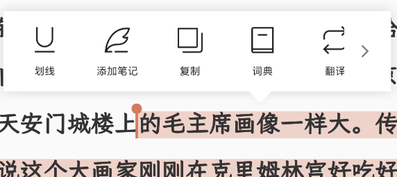
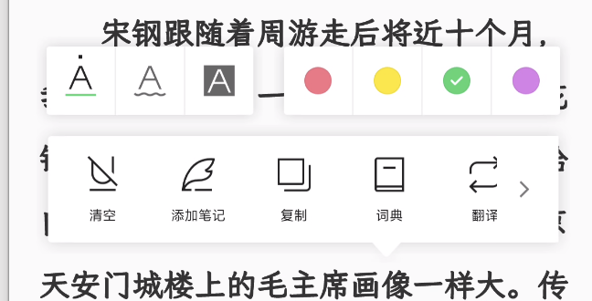

# 图书阅读器设计规范

| | |
|--|--|
| **PRODUCT** | [§4.6](../PRODUCT.md) · [§8 格式矩阵](../PRODUCT.md) |
| **相关** | [reader-chrome.md](./reader-chrome.md)、[library.md](./library.md) |
| **状态** | 规格 + **reflow 已落地**（Kaika controller + Anx Reader foliate-js/WebView） |

## 目标

**正文 EPUB** 的 reflow（文字流式）阅读。与漫画页图引擎在同一 App 内，按 `item.kind` 路由。

## 范围

### 做（v1）

- 导入 EPUB（reflow）：content-hash 去重、封面/标题元数据、`kind=book`。  
- 打开：按 spine **分节** 阅读；移动端提供**滚动 / 翻页**，桌面端仅提供**翻页**；进度写入不透明 locator。
- 阅读默认：字号、行距、水平/垂直边距、粗体、阅读背景、阅读模式、翻页效果（`pageTurnEffect`）。
- Chrome：返回、书签、搜索；底栏工具条（进度 · 目录 · 听书占位 · 亮度 · 字体排版 · 阅读模式）；打开阅读器时默认隐藏，中间点按显隐。
- 书内超链接：由 Foliate 处理 spine/fragment；外链经 Dart bridge 交系统打开。
- 书内搜索（顶栏 / 选区）；看大图（点正文图）。
- 与 comic 共享：整理三概念、书库壳、桌面 inset（不共享页图引擎）。

### 不做（本阶段）

- 在线书城；云端 AI 音色。听书见 [book-tts.md](./book-tts.md)（方案，系统 TTS）。词典/翻译另案（暂缓）。  
- 固定版式双栏 / 全页 `@page` / 复杂 flex-grid 还原（远）。

### EPUB CSS

EPUB 原始 HTML/CSS 由 Anx Reader 的 foliate-js 在系统 WebView 中排版，滚动和翻页共用同一浏览器 CSS 实现。OPF / 章节样式、class、选择器、媒体查询、图片与 `@font-face` 均按包内相对路径解析；用户字号、行距、页边距和阅读主题通过 style bridge 覆盖内容基准。不在 Dart 中维护第二套 CSS 解析器。

### Kaika 阅读基线（覆盖作者默认）

默认 `useBookStyles: false`：Kaika 注入的阅读 CSS **强制**覆盖作者默认字体、段首缩进、段距、正文色与链接色；EPUB class 的粗体 / 斜体等局部强调仍可生效。版式手感对齐微信读书：宽版心、上下留白、页眉页脚弱信息。

| 项 | 默认 |
|----|------|
| 字体 | PingFang SC → Hiragino Sans GB → Noto Sans SC → Microsoft YaHei → `sans-serif` |
| 纸白主题 | 背景 `#F7F7F7`、正文 `#333333` |
| 段首缩进 | `2em` |
| 段距 | 约 `0.35`（缩进为主，略留气口） |
| 行距 | 偏好默认 `1.7` |
| 移动端侧边距 | Foliate `gap` 约 `8%–16%`（**每侧 = gap/2**；默认 margin=24 → gap≈10% → 每侧约 5%） |
| 桌面侧边距 | `gap` 约 `4%–8%`；宽屏仍可自动双栏 |
| 上下边距 | `safeArea + labelBand + verticalMargin`；默认 `verticalMargin=26` → 移动约 `safe+50`；桌面上 `safe+52`、下 `safe+32` |
| 粗体 | 偏好 `bold` → Foliate `fontWeight` 700 / 400 |
| 页眉 | 左上当前章节（TOC label），弱灰常显；交互 chrome 打开时淡出 |
| 页脚 | 右下全书进度 `当前页 / 总页`（Foliate location；无则百分比） |
| 链接 / 标题色 | 主题 `linkColor` / `headingColor` |
| `@font-face` | 仅当用户提供 `fontPath` 时写入；系统字体栈不伪造空 face |

### 阅读主题 token（Readium 启发）

阅读主题与 App chrome 独立；token 级取值参考 Readium CSS，**不**整包注入 Readium 样式表。

| 主题 | 背景 | 正文 | 链接 | 标题（略柔于正文） |
|------|------|------|------|-------------------|
| paper | `#F7F7F7` | `#333333` | `#1A0DAB` | `#2A2A2A` |
| sepia | `#FAF4E8` | `#5F4B32` | `#6B5344` | `#4A3A28` |
| dark | `#121212` | `#B0B0B0` | `#63CAFF` | `#CCCCCC` |
| pureBlack | `#000000` | `#FEFEFE` | `#63CAFF` | `#E8E8E8` |

- **正文字体**：见上表 Kaika 基线；经 Foliate `fontName` 注入完整 CSS 列表。
- **链接**：使用主题 `linkColor`；脚注上标仍弱化、无下划线。
- **用户字号 / 行距 / 边距**仍覆盖 `body` 基准；主题色覆盖作者 CSS 的正文/链接/标题默认。

### 标题默认比例（相对用户字号）

滚动与翻页共用 rendition theme 的默认标题比例；EPUB 作者 CSS 可在非用户强制项上覆盖：

| 标签 | 字号倍率 | 段前 / 段后（× 用户字号） |
|------|----------|---------------------------|
| h1 | 1.75 | 1.4 / 0.9 |
| h2 | 1.45 | 1.2 / 0.75 |
| h3 | 1.25 | 1.0 / 0.6 |
| h4 | 1.15 | 0.8 / 0.5 |
| h5 | 1.10 | 0.7 / 0.45 |
| h6 | 1.05 | 0.6 / 0.4 |

- 字重 **bold**；h1/h2 可选轻微 `letter-spacing`。
- **不**强制居中章节标题——仅当 EPUB / 作者 CSS 已指定 `text-align: center` 时居中。

### 书签（v1）

- 顶部 chrome 可添加/移除**当前位置**书签。
- 书签**列表**在底栏「目录」抽屉的「书签」段；显示章节名与节内百分比；点击后按 `BookLocator` 跳转。
- 排版模式或字号变化不改变书签语义；locator 仍以 spine 节 + 节内进度保存。
- 书签是**点定位**；**不**承载划线（划线见下）。

### 选区菜单与划线（规范）

> 权威行为契约。参照微信读书式两段交互；视觉对齐见下方示意。新增动作前先改槽位表。实现刀序见 [book-reader-next-plan.md](./book-reader-next-plan.md)。

#### 参照

| 阶段 | 示意 |
|------|------|
| **① 选区动作条**（样式面板不出） |  |
| **② 划线编辑面板**（点「划线」或点已有划线后） |  |

视觉方向：浅色圆角卡片 + 底/顶小三角锚点；图标+短标签横排。Kaika 用自身 token 实现，不追像素。

#### 两段交互（核心）

```text
选区结束
  → 只出 ① 动作条（含「划线」入口等）
  → 样式（线型/颜色）此时不出现

点动作条「划线」
  → 切到 ② 划线编辑面板（线型 + 色板 + 动作行）
  → 选线型/色即写入（或先落默认划线再改，实现取简洁）

点正文里已有划线/高亮
  → 直接出 ②（可改色、改线型、清空、复制等）
  → 不先闪 ①
```

| 状态机 | 说明 |
|--------|------|
| `hidden` | 无菜单 |
| `actions` | ① 选区动作条 |
| `markup` | ② 划线编辑面板 |

`actions` → 点「划线」→ `markup`。`onAnnotationClick` → 直接 `markup`。收起 → `hidden`。

#### ① 选区动作条

- 单行横条：图标 + 文案；右侧可「›」进更多（超过容量时）。
- **不**附带色板、线型条。

| 槽 | 状态 | 行为 |
|----|------|------|
| 划线 | **已有** | 进 ② 并**立即落库**默认实线划线+黄；关闭菜单不删（清空才删） |
| 笔记 | **已有** | 打开编辑 sheet；写入 `book_annotations.note`；无标注时默认实线划线+黄 |
| 复制 | **已有** | 剪贴板 |
| 词典 | **已露出** | v1 占位提示 |
| 翻译 | **已露出** | v1 占位提示 |
| 书摘 | **已有** | 关菜单 → 金句卡片（排版/配色/底色；保存图·系统分享·复制图） |
| 搜索 | **已有** | 关菜单 → 打开搜索并以选区词预填 |
| 朗读 | **隐藏** | 跟听书 |
| 分享 / AI | **本程不做** | — |

① 默认露出：划线 · 笔记 · 复制 · 词典 · 翻译 · **搜索** · 书摘（书摘置末）。无后端的槽可短提示，由产品点将决定是否隐藏。

**笔记列表**（底栏「目录」抽屉 ·「笔记」段）：

- 仅列 `note` 非空的标注。
- 行展示：**笔记正文**为主；副行 = **原文摘录**（`selectedText`）；无原文时标明「无原文」而非只显示章节名。
- Tab 文案带数量（如 `笔记 (3)`）；抽屉记住上次停留的分段（目录/书签/笔记）。
- **点行**：关闭抽屉 → 跳 CFI → **打开编辑 sheet**（可改/清 note）。
- 行尾删除 = 清 `note`（保留划线/高亮），不删整条标注。
- 改样式/改笔记 **不得**用空值抹掉已存 `selectedText`；点正文标注时若缺原文则用 context 回填。
- **正文气泡**：`note` 非空时，在划线末端**上方**画小气泡（不盖字）；点气泡 `pointerup` 立刻开编辑 sheet（不做 DOM 探测）；开 sheet 默认不抢键盘焦点，避免 WebView 重排抖动。点划线本身仍进 ②。

#### 书摘金句卡

- 选区「书摘」关菜单 → 底部 sheet；**不落库**。
- 预览：摘文 · 章节 · 书名（无作者字段则省略）；水印 **Kaika**。
- **排版** 3 种（经典居中 / 左齐色条 / 大引号）；**配色·底色** 4～5 套纯色（无照片底）。
- 导出 PNG：`保存图片`（移动端相册 / 桌面文件）、`分享`（系统面板）、`复制`（剪贴板图片）。超长摘文卡内截断。

#### ② 划线编辑面板

布局（参照 phase2，可随锚点方向整体翻转，见下节）：

| 区块 | 内容 |
|------|------|
| **线型** | 实线划线 · **波浪线** · 高亮底 |
| **色板** | 四～五色圆点；当前色打勾 |
| **动作行** | 清空（删本条）· 复制 · 笔记 ·（可选）词典/翻译… 与 ① 同源槽位表 |

- **清空**：删除本条标注（含笔记）。
- 改线型/色：upsert 同一 `cfi`；**不得**抹掉已有 `note`。
- **笔记**：编辑/清空批注文案；空提交 = 清 note，保留线型色。
- 由选区进 ②：立即落默认实线划线+黄并写入 DB（桌面靠 Overlayer 保住视觉）。改线型/色 = upsert 同一 `cfi`。
- 由已有标注进 ②：展示当前线型与色；关闭不删。
- **关菜单不删标注**；只有「清空」或笔记列表清 note 会改库。

#### 实现状态机（权威）

```text
hidden
  ├─ selectionEnd ──────────────► actions
  ├─ annotationClick ───────────► markup
  └─ noteBubbleClick ───────────►（关菜单）开笔记 sheet
actions
  ├─ 划线（落默认 underline+黄）► markup
  ├─ 选区塌缩 / 空白 / Esc ─────► hidden
  └─ 复制等收起动作 ────────────► hidden
markup
  ├─ 改线型/色 ─────────────────► markup（原地 upsert）
  ├─ 选区塌缩 / 空白 / Esc ─────► hidden（保留标注）
  └─ 清空 ──────────────────────► hidden（删标注）
```

短暂 retain（~500ms）仅挡「点气泡导致的失焦清选区」，**不**锁整段菜单生命周期。  
关菜单后 ~800ms 仅忽略 overlayer 的「再开标注菜单 / 笔记气泡」连击，**不**拦截空白区翻页点按。  
**菜单仍打开时**点标注 = 关闭而非再开 ②。  
桌面不用 Flutter 全屏 dismiss 层（会搅乱 Platform View 命中），靠 JS `pointerdown` outside。  
移动端 dismiss 屏障：点空白关菜单；若落在左右约 1/4 翻页区，**同一次点按**顺带翻页（避免关菜单后还要点第二次）。  
打开书时：`renderAnnotations` 与 DB watch 竞态由 `requestAnnotationsRender` + hydrated 回推愈合。

#### 何时出现 / 收起

| 出现 | 结果状态 |
|------|----------|
| 正文选区结束（非脚注） | `actions` |
| 点动作条「划线」 | `markup`（立即落默认划线） |
| 点已有高亮/划线 | `markup` |
| 脚注内选区 | **不出现** |

| 收起 → `hidden` |
|-----------------|
| **选区塌缩**（非气泡内短暂 retain） |
| 空白点按：**桌面** JS `pointerdown` outside（气泡热区除外）；**移动** Flutter 全屏层（边缘区可同次翻页）；另：翻页/节跳、**Esc（优先关菜单）** |
| 复制成功 |
| 清空完成 |
| 打开目录等 chrome 面板 |
| 菜单已开时再点当前/任意标注（视为 dismiss，不重开 ②） |

菜单打开后：文案与 CFI **立即快照**。桌面点气泡会塌缩系统蓝选，**进 ② 后以 Overlayer 标注为准**。后续动作优先认快照。

移动端：关闭 WebView 系统选区菜单（`disableContextMenu` + `-webkit-touch-callout: none` + `contextmenu` preventDefault）；只保留 Kaika 选区气泡。**松手立刻出菜单**；仅拖动手柄且吞掉 pointerup 时，用短防抖（~160ms）补一次。

#### 弹出方向与贴边（兼容）

锚点 = 选区/标注包围盒；菜单水平尽量居中于锚点，再夹进安全区。

**主轴（垂直）**

| 条件 | 放置 | 三角 |
|------|------|------|
| 锚点上方空间 ≥ 菜单高 + 边距 | 菜单在选区**上方**，三角朝下 | 默认 |
| 上方不够、下方够 | 菜单在选区**下方**，三角朝上 | 翻转 |
| 上下都紧 | 选空间较大一侧；必要时缩小与锚点间距 | 仍指向锚点 |
| 贴顶/底安全区 | 菜单整体平移进 `padding`（含刘海/Home 条） | 三角仍指向锚点中心 x |

**② 面板内部排布随主轴翻转**

| 菜单在选区上方（常见） | 菜单在选区下方 |
|------------------------|----------------|
| 靠近正文一侧放三角 | 同上（三角永远在靠正文的边） |
| 区块顺序可保持「线型+色板 / 动作行」，整卡翻转后三角改朝向 | 勿把三角留在远离正文的一边 |

**横轴**

- 先按锚点中心对齐；左/右溢出则平移至左右安全区内。
- 气泡宽度：优先值约 272–304，**硬顶 340**；再与安全区（左右各 ≥12）取小，**禁止拉满屏宽**。窄屏均分槽位，不横向撑破。
- 三角水平位置跟锚点中心（夹在菜单左右内边距内），避免三角画在卡片外。

**桌面**

- 仅菜单与全屏关闭层可点；正文交互在菜单打开时让位于关闭层。
- 光标热区随菜单实矩形更新（区内 pointer，区外 default）。

**实现**：① 与 ② 共用同一套 `Placement`（anchor → 主轴方向 → 子块顺序 → 三角朝向 → 夹紧），禁止两套逻辑。

#### 数据与引擎

- 表 `book_annotations`：`cfi` + `type`（highlight / underline / wavy）+ `color` + 可选文案/笔记；`wavy` 经 Foliate `Overlayer.squiggly` 绘制。
- 与 bookmarks 分表；`renderAnnotations` 回灌。
- 表现层只经 controller。

#### 与当前实现的差距（迁移）

| 现实现 | 目标 |
|--------|------|
| 选区即出深色双行（动作+五色） | 选区只出 ①；样式进 ② |
| 高亮/划线两行五色同时露出 | 点「划线」或点标注后再出 |
| 删除仅在点标注时 | ② 内「清空」 |
| 深色气泡 | 浅色卡片 + 三角（按参照） |

迁移 = 刀 **②c**（交互改版），可与 ③ 前后点将。

#### 非目标

- 在线书城。云端神经 TTS / AI 音色（听书 v1 用系统 TTS，见 [book-tts.md](./book-tts.md)）。词典/翻译另案（暂缓）。

## 引擎决策

| 方案 | 说明 |
|------|------|
| **当前** | 导入探测、封面/元数据与阅读渲染统一使用 MIT `Anxcye/anx-reader` 的 foliate-js；导入使用不可见 WebView probe，阅读通过 Kaika 的 `flutter_inappwebview` adapter 接回 controller / CFI / TOC。 |
| **演进边界** | 不建设通用“可换引擎”接口；围绕自研管线拆分包解析、内容准备、定位、排版、输入适配与缓存策略。locator 契约继续保持不透明。 |

原则：**DB 不解析 locator**；节索引 + 节内进度分数属 format-owned JSON。包结构解析走库，不手写 OPF/NCX。

### 目录与链接

- 阅读与导入均使用 foliate-js 解析 EPUB3 `nav` / EPUB2 `toc.ncx` 和 spine；不再保留 Dart 侧第二套 EPUB 包解析器。
- 书内相对链接、fragment 和阅读历史由 Foliate rendition 处理，不在 Dart 侧重复解析 HTML。
- 外链经 `onExternalLink` bridge 用系统浏览器 / 邮件客户端打开（仅 `http` / `https` / `mailto`）。
- **书内搜索**：顶栏搜索键 / 选区「搜索」打开面板；`window.search` → `onSearch` 流式结果（章节分组）；点行 `goToCfi`；关面板 `clearSearch` 清高亮。默认全书范围、不区分大小写。
- **看大图**：正文图点击 → `onImageClick`（data URL）→ 全屏查看（缩放/拖动）；点空白或返回关闭。
- **导航抽屉**（底栏「目录」键）：分段 **目录 \| 书签 \| 笔记**；点行关闭抽屉并跳转。目录跳 TOC；书签跳 locator；笔记跳标注 CFI 并打开编辑 sheet（列表删 = 清 note）。打开恢复上次分段；「笔记」Tab 显示条数。

### 脚注

- 复用 Foliate 的 footnote 识别和弹层行为，经 typed bridge 接回 chrome/overlay。
- 弹层样式：`index.html` 提供中性圆角 surface + 半透明遮罩；`book.js` 的 `applyFootnoteTheme()` 按当前阅读主题色设置背景、边框与阴影。
- 不再保留 Dart HTML 预处理器或针对特定出版方 class 的第二套改写规则。

### 模式约定

- **打开时序**：点击后立即显示阅读底色 + 适应窗体的完整封面。Foliate `view.init` 完成（`renderer-load-end` / `reveal-unlocked`）即开始封面过渡（约 420ms），不必等 TOC/`attachEngine`。locator 与 loopback mount 并行；CFI 在首屏 init 传入。退出为短淡出。
- **页面上下留白**：Chrome 为覆盖式悬浮层，不永久占用完整操作栏高度；正文只保留系统安全区 + 8dp 阅读留白。Chrome 显隐不得改变分页尺寸或页码。
- **滚动（仅 iOS / iPadOS / Android）**：同一 foliate Paginator 切换为 `flow=scrolled`，位置仍由 CFI 表示；切模式和尺寸变化不销毁 WebView。跨 spine 节仍按 Anx 语义单 iframe 挂载：接近章节边界时预加载相邻节 HTML，新节 iframe 就绪后再替换旧节（避免空白卡顿）；节末上/下滑仍由 `book.js` 触发 `nextPage`/`prevPage` 进入下一节。
- **翻页**：正文交给 Anx foliate Paginator 的 CSS multi-column、方向锁定和 snap；移动端横滑跟手、释放后吸附到相邻页，点按/按钮翻页复用其 200–300ms 动画。Dart 不生成 page list，也不运行 `TextPainter` 章节分页。尺寸/生命周期切换开始时冻结最后一个稳定 CFI，并忽略离屏、零尺寸阶段产生的 relocation；普通尺寸变化保留同一 WebView 并由 ResizeObserver reflow 后回到冻结位置。若 Android 在内外屏切换时报告 renderer process gone，则立即移除失效 WebView，待 App resumed 后用该 CFI 重建一次。
- **翻页效果**（`BookPageTurnEffect`，仅翻页模式）：

  | 值 | 标签 | v1 |
  |----|------|-----|
  | `slide` | 滑动 | **默认值**；Anx Paginator snap 跟手，点按/按钮按距离使用 200–300ms 吸附动画。 |
  | `none` | 无效果 | 调用 rendition `next` / `prev` 直接换页。 |
  | `curl` | 仿真翻页 | **占位**：持久化与设置可选；引擎暂回退为 `slide`。真仿真卷曲另开刀。 |
- **点按**：翻页模式左右约 1/4 翻页、中间显隐 chrome；WebView 内链、表单控件与文字选择优先于空白点按。滚动模式点空白显隐 chrome。
- **平台能力策略**：正文是可直接操纵的阅读画布。macOS / Windows 暂不暴露滚动模式；打开时即使历史偏好为滚动也必须归一到翻页，阅读器与全局设置均不显示滚动选项。移动端两种模式仍共用输入设备策略。

  | 平台 / 输入 | 滚动模式 | 翻页模式 |
  |-------------|----------|----------|
  | iOS / iPadOS / Android：触摸、手写笔 | 纵向拖动，使用平台惯性与边界反馈 | 横向滑动达阈值后翻页；点按左右区翻页 |
  | macOS / Windows：触控板、滚轮 | 不提供 | 触控板横向手势翻页；不把纵向滚轮隐式映射成翻页 |
  | macOS / Windows：鼠标按住拖动 | 不提供 | 横向拖动达阈值后翻页 |
  | 键盘 | 移动端不作为主输入 | 左右键、PageUp / PageDown、Space 翻页 |

  翻页阅读画布须显式允许 `touch`、`mouse`、`stylus`、`trackpad`；鼠标拖动只作用于正文画布，不改变书库与设置列表的系统桌面行为。链接点击和文字选择仍优先，形成拖动后不得触发空白点按。
- **位置 chrome**：foliate-js 不构建全书 Dart pageMap；底栏显示章节序和 CFI/section fraction 换算的全书进度，不伪造受字号/窗口影响的固定总页数。
- **失败恢复**：包解析或 rendition display 失败必须结束 loading 并显示明确错误，不得悄悄保留旧页造成假成功。
- **异步隔离**：每次 WebView attachment 持有 generation lease；renderer 重建、快速退出或 session dispose 后，旧 generation 的 load、relocation、click、console 与 error 回调全部忽略。
- **打开诊断**：debug 日志分段记录 `server-ready → webview-created → renderer-load-end → reveal-unlocked → publication-attached → first-relocation`；renderer 被系统杀死时另记 `renderer-gone → renderer-recovered`，用于区分文件服务、WebView 冷启动、EPUB rendition 与折叠切屏恢复耗时。
- **资源预算**：App 生命周期共享 `BookLoopbackServer`（稳定端口 + foliate 内存缓存 / HTTP Cache-Control）；EPUB 用 `File.openRead()` 挂载。zip.js 建 ZIP 索引并只挂载当前章节，切章 unload 旧 section。离开阅读器时 **unmount 书 + 释放 WebView**，不关 loopback。
- **嵌入字体**：交由 WebView 按 EPUB 原始 `@font-face` 与相对路径加载，不注册到 Flutter 进程级字体表。
- **排版设置**（底栏「字体排版」面板，对齐微信读书结构）：主题大卡（阅读背景）；字号连续滑杆 + **B**；行距连续滑杆；水平/垂直页边距双滑杆；**字体**子面板；**更多设置**子面板。滑杆拖动只更新面板预览值，松手后一次性提交 controller、持久化并触发重排。
- **亮度**：底栏太阳键展开亮度滑杆；在 WebView 内用 `pointer-events:none` 遮罩调暗（不改系统亮度、不挡桌面 Platform View 点击），与阅读主题分离。
- **正文字体**：`BookBodyFont` → Foliate `fontName`（默认 = Kaika 黑体栈；`system` = Foliate `system-ui`；具名脸用 CSS 栈 + 系统回退，v1 不 bundling 字体文件）。
- **更多排版**：`letterSpacing`（px）、`paragraphSpacing`（em）、`textAlign`（start/justify）、`firstLineIndent`（0 / 2em）、`hyphenate`。
- 图片：按 OPF 相对路径解析，读取时补 `contentDirectoryPath`（如 `OEBPS/`）。  
- Chrome「页」导航仅在 `readingMode == page` 且 rendition 已绑定外部 next / prev 时启用。

### Chrome 几何

- 顶栏内容高：`kBookReaderChromeBarHeight`（56）。  
- 底栏内容高：`kBookReaderChromeBottomHeight`（padding + IconButton）。  
- 上述尺寸只用于悬浮 Chrome 自身，不参与正文 `pageSize`；正文使用“页面上下留白”中的稳定平台 inset。

## Locator 契约（book）

```json
{
  "sectionIndex": 0,
  "progressInSection": 0.0,
  "cfi": "epubcfi(/6/2!/4/2)",
  "spineVersion": 1
}
```

- `sectionIndex`：spine 线性项下标（仅 `itemref` 顺序）。  
- `progressInSection`：0…1，节内进度。  
- `cfi`：Foliate 原生语义位置；存在时恢复和书签跳转优先使用它。
- `spineVersion`：spine 解析规则变更时递增以作废进度。  

整书 `progress_fraction` ≈ `(sectionIndex + progressInSection) / sectionCount`。

## 导入

- 扩展名：`epub`（`BrandConfig.app.importExtensions`）。  
- 路由：`EpubImportRouter` 自动探测 — 正文 EPUB → book import；页图 EPUB → comic import。正文探测须在 spine 中均匀抽样，并以实际抽样节数计算文本密度；不能只采开头后除以全书节数，避免套装书被插图误判成漫画。
- 存储：与 comic 相同 content-addressed 布局，同一 `library` / `covers` 目录。  
- 提交：源文件先进入同一 support root 下的 `.import-staging`，在临时文件上完成解析和封面；成功后原子移动并写 DB，失败时不得在正式目录留下文件。
- 数据库现有 `pageCount` 字段对 book 暂存 `sectionCount`，UI 不把它显示为受排版影响的真实页数。

## UI

- 全屏阅读；顶栏：返回 / 标题 / **当前位置书签**（添加/移除）。书签列表与笔记列表收束进底栏「目录」抽屉三段面板。  
- 底栏：工具条（进度 + 目录/字体/亮度/模式/听书占位）；「目录」打开 **目录 \| 书签 \| 笔记**。  
- 桌面：顶栏遵守 `DesktopTitleBarMediaQuery`；mac 左侧让红绿灯。  
- 空态 / 失败：安静中文文案。

## 打开路由

```text
条目 kind=book → BookReaderScreen
条目 kind=comic → ComicReaderScreen
```

书库壳共享；**禁止** book 条目进入 comic 页图 session。

## 验收

1. 导入 reflow EPUB → 书库出现，kind=book。  
2. 移动端滚动与翻页均可阅读；桌面端只能进入翻页；目录 / 书签跳转正确。
3. 移动端触摸 / 手写笔、桌面触控板 / 鼠标拖动均符合上表。
4. 退出再进恢复章节与大致位置。
5. 页图 EPUB 自动进入漫画引擎。
